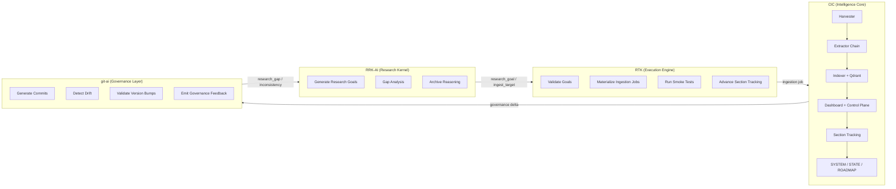

# CIC-AI Runtime Diagram

## Four-Agent Loop (Mermaid)



## Operator Notes

### 1. The Four-Agent Loop is Explicit

```
RRK-AI → RTK → CIC → git-ai → RRK
```

This is the core of the Runtime Contract.

### 2. CIC's Internal Pipeline is Isolated

CIC's internal modules (Harvester, Extractor Chain, Indexer, Dashboard, Section Tracking, Docs) are not part of the multi-agent loop — they're internal to CIC and represent the intelligence core's deterministic pipeline.

### 3. Data Flow Arrows Match the Contract

- **RRK → RTK**: `research_goal`, `gap_fill_goal`, `archive_target`, `ingest_target`
- **RTK → CIC**: Ingestion jobs with schema `{ job_id, type, source, metadata }`
- **CIC → git-ai**: Governance deltas with schema `{ system_version, state_version, roadmap_version, changes }`
- **git-ai → RRK**: Research gaps, inconsistencies, archival leads, narrative opportunities

### 4. No Subsystem Crosses Its Boundary

This is the key invariant of the Runtime Contract. Each subsystem has clear ownership and cannot act outside its role.

---

## Diagram as ASCII (for README.md inline display)

```
┌─────────────────────┐
│   RRK-AI Kernel     │
│ (Research Reasoning)│
└──────────┬──────────┘
           │
           │ research_goal
           │ ingest_target
           ↓
┌─────────────────────┐
│   RTK Toolkit       │
│ (Execution Engine)  │
└──────────┬──────────┘
           │
           │ ingestion job
           ↓
┌─────────────────────────────────┐
│   CIC Intelligence Core         │
│ Harvester → Extractor → Indexer │
│ Dashboard → Section Tracking    │
└──────────┬──────────────────────┘
           │
           │ governance delta
           ↓
┌─────────────────────┐
│   git-ai Governance │
│ (Compliance Officer)│
└──────────┬──────────┘
           │
           │ research_gap
           │ inconsistency
           ↓
         (back to RRK)
```

---
