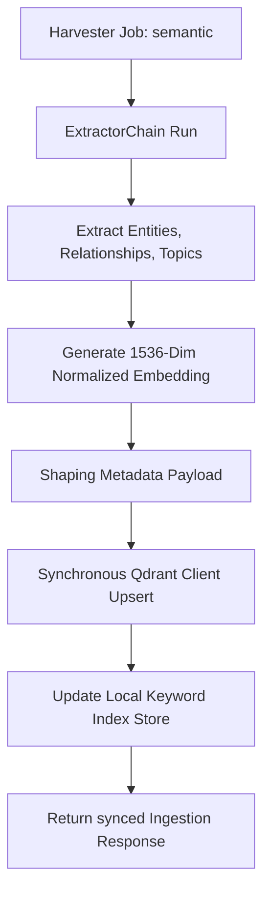
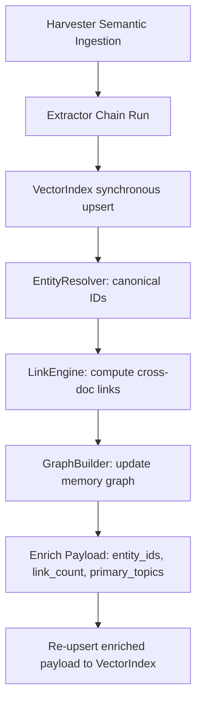
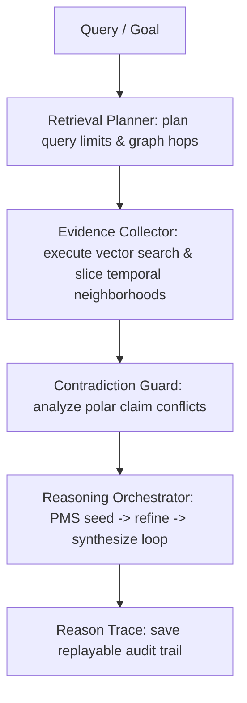

# CIC_SYSTEM.md

## 0. Multi‑Agent Runtime (External Contract)

CIC participates in a four‑agent orchestration loop with RTK, RRK‑AI, and git‑ai.
The authoritative definition of this runtime — including roles, boundaries,
data contracts, failure modes, and versioning rules — is defined in:

**CIC_AI_RUNTIME_CONTRACT.md**

This contract sits above CIC_SYSTEM.md in the documentation hierarchy and governs
all cross‑agent interactions. CIC_SYSTEM.md continues to define CIC's internal
architecture (ingestion pipeline, extractors, indexer, dashboard, control plane,
and section tracking), while the Runtime Contract defines how CIC interacts with
external agents.

---

## 1. Overview

CIC (Cast Iron Charlie Intelligence Core) is the ingestion, enrichment, and indexing
subsystem of the Cast Iron Charlie documentary intelligence engine. CIC operates
within the Runtime Contract and receives ingestion jobs from RTK, executes them
deterministically, and emits governance deltas to git-ai.

---

## 2. Core Components

### 2.1 Ingestion Pipeline

The deterministic pipeline that processes ingestion jobs:

1. **Harvester** — Fetches source content
2. **Extractor Chain** — Extracts structured data
3. **Indexer** — Indexes vectors into Qdrant
4. **Dashboard** — Surfaces results
5. **Section Tracking** — Maintains deterministic state

### 2.2 Extractor Chain

Pluggable extractors that process different content types:

- ImageAnalyzerV2 — Extracts visual information from images
- ReverseImageSearchExtractor — Finds similar images in archives
- OCR Extractor — Extracts text from images
- Custom Extractors — Domain-specific extraction logic

### 2.3 Indexer + Qdrant

Vector storage and semantic search:

- Stores embeddings with metadata payloads
- Supports semantic search across ingested content
- Maintains backup + restore capabilities

### 2.4 Control Plane

Orchestration and management:

- Job queue management
- Error handling and retry logic
- Resource monitoring
- Health checks

### 2.5 Section Tracking

Deterministic, resumable ingestion state:

- Tracks completion at section boundaries
- Enables pause/resume of ingestion
- Provides auditability
- Ensures monotonic advancement

---

## 3. Data Flows

### 3.1 Ingestion Job (RTK → CIC)

```json
{
  "job_id": "uuid",
  "type": "image | document | reverse_image",
  "source": "path or URL",
  "metadata": { }
}
```

### 3.2 Vector Payload (CIC → Qdrant)

```json
{
  "id": "fileId",
  "vector": [ ... ],
  "payload": {
    "file_path": "...",
    "extractor": "ImageAnalyzerV2 | ReverseImageSearchExtractor",
    "timestamp": "ISO"
  }
}
```

### 3.3 Governance Delta (CIC → git-ai)

```json
{
  "system_version": "1.2.1",
  "state_version": "1.3.1",
  "roadmap_version": "2.6.1",
  "changes": [ ... ]
}
```

---

## 4. Ingestion Determinism

CIC ingestion is:

- **Deterministic** — Every execution follows the same path
- **Resumable** — Can pause and resume at section boundaries
- **Auditable** — Full state visibility at each point
- **Monotonic** — Sections can only advance, never regress

---

## 5. Error Handling

When CIC fails:

- Emit error state to Section Tracking
- Emit drift detection signal to git-ai
- Block Section Tracking advancement
- git-ai runs drift check and emits research goals back to RRK-AI

---

## 6. PMS Integration & PMS v2 Compositional Engine

The Prompt Management System (PMS) has been evolved to **PMS v2**, exposing a compositional, multi‑stage prompt engine that integrates with ExtractorChain and the semantic pipeline.

### 6.1 PMS Role & V2 Capabilities

- **Composes prompts** for extractors based on content type, stages, and constraints.
- **Compositional Inheritance**: Templates can inherit from a parent template (`parent: parent_id`) and override designated slot slots (`[[block:block_name]]...[[endblock]]`) via the `blocks` dictionary in their YAML configuration.
- **Conditional Evaluation**: Resolves runtime guards using `[[if condition]]...[[endif]]` structures. Supports arbitrary combinations of logical negations (`!`), ANDs (`&&`), and ORs (`||`).
- **Vector Index Snippet Lookup Hooks**: Allows safe, rate‑limited injection of historical context directly into templates using the `[[index_lookup query="text" limit=N]]` tag.
- **Multi-Stage Orchestration & Caching**: Manages multi-pass prompt stages (`seed` $\rightarrow$ `refine` $\rightarrow$ `summarize`) inside `ExtractorChain` and leverages SHA-256 in-memory caching to skip repeat compositions.
- **Isolates Composition Failures**: Logs and captures compilation or validation failures inside the returned metadata object instead of aborting unrelated pipeline runs.

### 6.2 PMS Location in Pipeline

```
Harvester
    ↓
Control Plane (receives job)
    ↓
PMS v2 Composer (resolves inheritance, conditional blocks, index snippet lookups)
    ↓
Extractor Chain (executes multi-stage seed -> refine -> summarize passes)
    ↓
Indexer (stores vector embeddings with metadata payload in Qdrant)
    ↓
Dashboard / Section Tracking
```

### 6.3 YAML Schema & Inheritance Example

#### Base Layout Template (`base_semantic.yaml`)
```yaml
template_id: base_semantic
name: Base Semantic Template
version: "2.0.0"
extractor_type: custom
content_type: semantic
template: |
  =============================================================
  CAST IRON CHARLIE - SEMANTIC WORKFLOW
  =============================================================
  [[block:stage_header]]STAGE: Ingestion[[endblock]]

  Source text:
  """
  {source}
  """

  [[block:stage_instructions]]Core extraction rules.[[/block]]

  [[if is_final_stage]]
  Final pass compilation: Organize all facts into canonical JSON-LD.
  [[endif]]
created_at: "2026-05-30T00:00:00Z"
max_tokens: 3000
temperature: 0.2
top_p: 0.95
```

#### Child Extraction Template (`semantic_seed.yaml`)
```yaml
template_id: semantic_seed
name: Semantic Seed Stage
version: "2.0.0"
extractor_type: custom
content_type: semantic
parent: base_semantic
blocks:
  stage_header: "STAGE 1: Seed Entity Extraction"
  stage_instructions: "Extract all PEOPLE and PLACES with context."
template: ""
created_at: "2026-05-30T00:00:00Z"
max_tokens: 2000
temperature: 0.3
top_p: 0.90
```

### 6.4 PMS Caching & Multi-Stage Integration

- **Cache Key Generation**: `SHA256(template_id + stage + serialized_sorted_variables)`
- **Multi-Stage API Hook**: Exposed to `ExtractorChain` via `pms.requestPrompt(stage, context)`.
  - **Pass 1 (`seed`)**: Maps to `semantic_seed`, extracting entities from source.
  - **Pass 2 (`refine`)**: Maps to `semantic_refine`, resolving relationships, querying `[[index_lookup]]` context.
  - **Pass 3 (`summarize`)**: Maps to `semantic_summary`, generating contextual syntheses with finalization checks.

### 6.5 PMS Configuration & Diagnostics

- **Template Registry Location**: `projects/cic/pms/templates/` (supports `custom/`, `vision/`, `ocr/`)
- **Control Plane Endpoint Extensions**:
  - `GET /pms/templates`: Lists all active templates loaded in the registry.
  - `POST /pms/resolve`: Receives `templateId` and `vars`, returning the fully resolved prompt and compilation metadata for real-time debugging.

---


## 7. RTK Automation Layer (Active Automation)

RTK orchestrates active automation loops driven by contract-defined research goals:

### 7.1 Burst Ingestion Planner (Mode A)
- Batches goals received from RRK-AI into bounded ingestion sets called bursts.
- Grouping occurs by priority and target type (e.g. `image`, `text`).
- Emits structured `CICIngestionJob` models with assigned PMS templates.

### 7.2 Smoke-Test Gating (Mode B)
- Gates section-tracking state boundaries with verification checks.
- Confirms PMS template compilations succeed and extractors process jobs cleanly.
- Blocks advancement, transitions sections to `blocked:smoke_failed`, and dispatches governance warnings on failures.

### 7.3 Concurrency & Safeguards
- Emits structured backpressure controls.
- Halts executions and alerts the `cic-gitai` feedback channel if the burst-level job failure rate exceeds a 50% threshold.

### 7.4 Telemetry State Endpoint
- Exposes automation state at `GET /rtk/automation/state`.

---

## 8. Semantic Indexing Layer (v1.2.0 Phase 2)

 equips the Cast Iron Charlie pipeline with cross-document vector memory, hybrid vector-keyword search capabilities, and live diagnostics.

### 8.1 Subscription & Ingestion Flow (Inline Synchronous Braid)

Semantic jobs run through a synchronized pipeline inside the Harvester:
1. **Extractor Chain**: Evaluates the document via the compositional chain of v2 extractors (`SemanticExtractor` $\rightarrow$ `RelationshipExtractor` $\rightarrow$ `TopicExtractor`).
2. **Embedding Generation**: Encodes the raw document text into standard **1536-dimensional normalized vectors** using the `EmbeddingPipeline` (with a high-fidelity deterministic hashing fallback for isolated runtime tests).
3. **Payload Shaping**: Packs all extracted JSON-LD schemas (`entities`, `relationships`, `topics`, `summary`) into the final vector point payload.
4. **Qdrant Sync Upsert**: Synchronously commits the point to Qdrant via the client wrapper, guaranteeing atomic consistency.



### 8.2 Reciprocal Rank Fusion (RRF) Hybrid Search

To resolve the discrepancy between float-based cosine distances and integer-based keyword matches, search uses Reciprocal Rank Fusion ($k = 60$) to combine results:

$$RRF\_Score(d) = \sum_{m \in \{\text{Vector}, \text{Keyword}\}} \frac{1}{60 + \text{Rank}_m(d)}$$

1. **Vector similarity retrieval**: Queries Qdrant using Cosine distance similarity.
2. **Keyword substring retrieval**: Scans local in-memory text indexes.
3. **Fusion & Sorting**: Intersects both streams and ranks results by their cumulative reciprocal rank.

### 8.3 Control Plane Integrations

The Control Plane exposes the vector memory interface at the following endpoints:

- **`GET /index/health`**:
  Returns the live diagnostics and collection integrity report:
  ```json
  {
    "health": {
      "collection": "cic_semantic",
      "status": "green",
      "vectors": 14,
      "last_upsert": "2026-05-30T04:45:00Z",
      "embedding_version": "v2.0.0"
    }
  }
  ```

- **`POST /index/search`**:
  Processes semantic queries with optional result caps:
  ```json
  {
    "results": [
      {
        "id": "doc-uuid",
        "rrf_score": 0.0327,
        "payload": {
          "rawText": "...",
          "entities": [],
          "relationships": [],
          "topics": []
        }
      }
    ]
  }
  ```

---

## 9. Cross‑Document Linking Layer (v1.2.0 Phase 3)

The Cross-Document Linking Layer connects discrete processed documents into a unified, queryable semantic knowledge fabric. It resolves entity aliases, establishes multidimensional cross-document links, maintains an in-memory graph view, and exposes a rich query plane.

### 9.1 Linking Architecture & Pipeline

After a document is processed by the Extractor Chain and indexed into Qdrant, a post-index hook triggers the Linking pipeline:

1. **Entity Resolver**: Normalizes entity names (handling spacing, casing, and "Last, First" re-ordering) and assigns stable deterministic IDs using a typed name hash. Resolves variants/aliases using token-overlap matching and string distance metrics.
2. **Link Engine**: Analyzes the newly indexed document against all historical documents to deduce cross-document links (`same_entity`, `related_topic`, `co_occurs_with`, `references`) with confidence bounds between `0.0` and `1.0`.
3. **Graph Builder**: Updates a queryable in-memory graph containing documents and entities as nodes, and relationships and cross-document links as edges.
4. **Index Enrichment**: Enriches the indexed document's payload with `entity_ids`, `link_count`, and `primary_topics` to enable richer downstream semantic search.



### 9.2 Graph Model & Neighborhoods

The in-memory graph supports query-plane access via the following endpoints:

#### GET `/graph/summary`
Returns graph scale metrics, health diagnostics, and degrees for top entities:
```json
{
  "nodes": { "documents": 2, "entities": 5, "total": 7 },
  "edges": { "entityRelationships": 1, "crossDocLinks": 2, "docEntityLinks": 4, "total": 7 },
  "topEntities": [
    { "entityId": "ent_cb37e8badbacd399", "name": "Charles Emil Sorensen", "type": "PEOPLE", "degree": 4 }
  ],
  "health": { "status": "green", "details": "Graph initialized with 2 documents and 5 entities." }
}
```

#### GET `/graph/entity/:id`
Returns entity metadata, connected documents, and neighboring entity relationships:
```json
{
  "entity": { "id": "ent_cb37e8badbacd399", "name": "Charles Emil Sorensen", "type": "PEOPLE", "context": "Birth record", "confidence": 0.95 },
  "documents": [
    { "docId": "doc-c1", "summary": "Semantic Ingestion Summary", "timestamp": "2026-05-30T17:40:00Z" }
  ],
  "relationships": [
    { "targetEntityId": "ent_lellinge", "targetEntityName": "Lellinge", "predicate": "born_in", "confidence": 0.98, "details": "Born in Denmark" }
  ]
}
```

#### GET `/graph/document/:id`
Returns document metadata, contained entities, and related documents connected via cross-document links:
```json
{
  "document": { "docId": "doc-c2", "summary": "Semantic Ingestion Summary", "timestamp": "2026-05-30T17:40:05Z" },
  "entities": [
    { "id": "ent_cb37e8badbacd399", "name": "Charles Emil Sorensen", "type": "PEOPLE", "context": "Emigration", "confidence": 0.9 }
  ],
  "relatedDocuments": [
    { "docId": "doc-c1", "type": "same_entity", "confidence": 0.92, "details": "Both documents reference resolved entity \"Charles Emil Sorensen\"." }
  ]
}
```

---

## 10. Persistent Knowledge Graph (v1.3.1)

The Persistent Knowledge Graph replaces the ephemeral in-memory graph representation with a durable, queryable filesystem database and supports dated, non-destructive historical slicing.

### 10.1 Serialization Roundtrips & Path Security
*   **Database Files**: Serializes objects to structured JSON files under `projects/cic/data/entity-registry.json` and `projects/cic/data/graph-store.json`.
*   **Absolute Resolution**: Enforces dynamic ESM path resolution (`import.meta.url` $\rightarrow$ `fileURLToPath`) to guarantee database paths resolve identically inside both test environments and PM2 production runtimes.
*   **Transaction Gating**: Executes auto-saves synchronously inside the Harvester post-ingestion loop before indexing final RAG results.

### 10.2 Entity Lineage & Dynamic Slicing
To support temporal queries, every canonical entity stores a chronological `lineage` array recording creation, alias merges, name refinements, and context enrichments:

```typescript
export interface EntityLineageEntry {
  timestamp: string;
  docId: string;
  action: "created" | "merged_alias" | "context_enriched" | "name_updated";
  originalName?: string;
  contextAdded?: string;
}
```

*   **Dynamic Playback (`sliceAtDate`)**: Reconstructs exact node/edge states at any target timestamp `dateX` without duplicating files by replaying lineage chronologically, subtracting future context additions and reverting name refinements.

---

## 11. Retrieval-Augmented Reasoning Layer (v1.3.2)

The Reasoning Layer equips Cast Iron Charlie with multi-hop retrieval capabilities, polar claim contradiction checks, and audit-ready reasoning traces.

### 11.1 Subsystem Pipeline
The RAG reasoning query loop processes in four stages:



1.  **Retrieval Planner**: Analyzes natural language strings, matches keywords against registered canonical entities, plans graph traversals up to depth $N$, and sets strict token budgets.
2.  **Evidence Collector**: Aggregates ranked float-based vector results, loads sliced graph neighborhoods, and filters entries dynamically based on `sliceAtDate`.
3.  **Contradiction Guard**: Compares evidence strings for polar facts (e.g. origins associated with Denmark vs Chicago/Detroit) and flags contested claims.
4.  **Reasoning Orchestrator**: Executes a multi-pass compositional prompting chain (`seed` $\rightarrow$ `refine` $\rightarrow$ `synthesize`) via PMS v2 to compile the final answered RAG summary.

### 11.2 Trace Schema & Auditing
Reasoning traces are saved as audit-ready JSON logs under `projects/cic/data/traces/`:

```json
{
  "traceId": "trc_uuid",
  "query": "Charles Sorensen birthplace",
  "plan": { ... },
  "evidenceEvaluated": [
    { "evidenceId": "doc-A", "type": "document", "score": 0.95, "action": "used", "reason": "Matched constraints" }
  ],
  "contradictionsDetected": [
    { "claimA": "Denmark origins", "claimB": "Chicago origins", "severity": "high" }
  ],
  "stageLatenciesMs": { "planning": 12, "collection": 145, "reasoning_loop": 402 },
  "finalAnswer": "...",
  "confidence": "low",
  "isContested": true
}
```

---

## 12. SkillOpt Subsystem (v0.1.0 — Stage 2 Integration)

CIC integrates with SkillOpt to train and deploy self-improving skills (starting with **RewriteLabs Redesign**).

### 12.1 Purpose & Integration

SkillOpt turns CIC's documentary analysis pipeline into a **skill trainer**:

- **Data Production:** Harvester emits `SkillOptItem` JSON files (DOM snapshot + audit deltas + target redesign) when `--emit-skillopt` is enabled.
- **Validation:** SkillOptValidator scores outputs against inputs across 6 metrics (structural completeness, heuristic alignment, a11y, performance, brand voice, determinism).
- **Training:** SkillOpt consumes items from `./skillopt/data/{train,val,test}` and trains skill templates (external Python harness).
- **Deployment:** `skillopt:deploy` exports `best_skill.md` and registers it in the runtime SkillRegistry.
- **Runtime:** CIC loads `best_skill.md` via `SkillRegistryLoader` and passes it to RedesignAgent.
- **Observability:** SkillOptTelemetry logs skill versions, validation scores, and runtime metrics.

### 12.2 Data Contract: SkillOptItem

Emitted by Harvester after `SYNTHESIZE`:

```json
{
  "id": "item_uuid",
  "input": {
    "dom": "<html>...</html>",
    "content_blocks": [ { "type": "nav", "text": "...", "role": "..." }, ... ],
    "audit_deltas": { "contrast_issue_1": 0.6, "layout_reflow": 0.4, ... },
    "heuristics": { "ux_score": 0.72, "ia_score": 0.81, ... }
  },
  "target": {
    "redesign_plan": "# Redesign Summary\n..."
  },
  "metadata": {
    "url": "...",
    "brand_voice": "modern, accessible, conversational",
    "timestamp": "ISO"
  }
}
```

### 12.3 Validation Metrics

SkillOptValidator computes 6 scores (0-1):

1. **structural_completeness:** Required sections present in redesign output.
2. **heuristic_alignment:** Redesign addresses audit deltas from input.
3. **accessibility_uplift:** Covers a11y issues (contrast, alt text, labels).
4. **performance_uplift:** Covers perf issues (LCP, CLS, bundling, lazy loading).
5. **brand_voice_similarity:** Output aligns with brand vocabulary.
6. **determinism_score:** Consistency across multiple rollouts.

### 12.4 CLI Commands (Stage 2-3)

**Stage 2 (Active):**
```bash
cic skillopt:emit [--url-pattern PATTERN]
  # Run pipeline and emit SkillOptItems to ./skillopt/data

cic skillopt:validate <item.json> <output.md>
  # Score a single redesign output against its input
  # Returns JSON with 6 validation metrics
```

**Stage 3 (Upcoming):**
```bash
cic skillopt:data-gen [--base-dir DIR]
  # Generate synthetic SkillOptItems for testing

cic skillopt:train [--config skillopt-config-redesign.yaml]
  # Train Redesign skill from ./skillopt/data

cic skillopt:deploy [--skill-version V]
  # Export best_skill.md and reload SkillRegistry

cic skillopt:telemetry [--recent N]
  # Show skill versions, validation scores, rollout metrics
```

### 12.5 Governance

- **TokenEconomyAgent:** SkillOpt training respects max_cost budget.
- **SecuritySentinelAgent:** Exported skills signed with SHA-256; validation gate required before deploy.
- **AuditAgent:** Every skill rollout audited; regressions logged and flagged.

### 12.6 Stage 3 Dependencies

Stage 3 (train/deploy/runtime) requires:

- [x] **SkillRegistryLoader** (`projects/cic/src/skills/SkillRegistryLoader.ts`) — Load and cache trained skills at runtime.
- [x] **RedesignAgent skill-awareness** — Accept loaded skill as constructor parameter.
- [ ] **Python training harness integration** — Wire `skillopt:train` CLI to external trainer.

See **CIC_SKILLOPT_SYSTEM.md** for full subsystem specification.

---

## 13. Observability Subsystem (v1.3.3 — Cockpit and Telemetry v2)

The Observability Subsystem exposes real-time runtime diagnostics, rates, latencies, and automation logs across all five architectural pillars.

### 13.1 Telemetry Core Architecture
Telemetry is driven by an in-memory `MetricsCollector` loaded in the Express control plane. System timing and event counters are gathered via inline instrumentation hooks:

*   **Ingestion & Extractors**: Logs rolling documents/min, errors/min, and individual stage execution times for `SemanticExtractor`, `RelationshipExtractor`, and `TopicExtractor` inside `ExtractorChain.run()`.
*   **Vector Memory (Qdrant)**: Computes p50/p95/p99 query latencies using circular arrays of size 1,000, bounding telemetry memory footprint.
*   **Persistent Graph**: Logs start-up database deserialization durations (`recordGraphLoad`) and tracks manual/auto snapshot serialization sizes and durations.
*   **RAG Reasoning**: Tracks stages per query, evidence sizes, and contradiction markers (`contradictionRate`).
*   **RTK Automation**: Records safeguard violations, active/dry-run states, and recent automated interventions.

### 13.2 Control Plane Telemetry Router
Exposes routes for the operator dashboard under `/metrics`:
*   `GET /metrics/snapshot`: Returns a compiled JSON representation of current statistics.
*   `GET /metrics/stream`: Real-time SSE (Server-Sent Events) streaming endpoint delivering sub-second updates.
*   `POST /metrics/reset`: Wipes in-memory buffers to reset benchmarks.

### 13.3 High-Density Dashboard Cockpit
Upgraded `canary-dashboard.html` features a glassmorphism dark-theme dashboard visualizing all five telemetry panels, and integrates an inline multi-hop RAG testing console with direct trace audits.

---

## 14. Multi‑Tenant Knowledge Fabric & Episode Builder (v1.4.0)

CIC v1.4.0 introduces robust **Multi-Tenant Knowledge Fabric** isolation and the **Documentary Episode Builder Engine**.

### 14.1 Tenant-Scoped Persistences
- **Entity Resolver**: Registries and name-refinement lineages are dynamically partitioned per tenant in-memory and saved under `data/tenants/{tenantId}/entity-registry.json`.
- **Memory Graph**: Document nodes, relationship occurrences, date slicings, and checkpoints are partitioned under `data/tenants/{tenantId}/graph-store.json`.
- **Vector index**: Queries isolated Qdrant collection namespaces `cic_semantic_{tenantId}` and keyword matching stores in-memory.

### 14.2 Documentary Episode Builder Engine
- Exposes stable REST routes `/v1/episode/build`, `/v1/episode/expand`, and `/v1/episode/summarize` in [v1-router.ts](file:///c:/dev/rewrite-mcp/projects/cic/src/cic/control-plane/v1-router.ts).
- Drives multi-hop graph retrieval and temporal neighborhood playbacks to compile structured creative Act Outlines, detailed scene expansions, and cinematic biographic syntheses.
- Coordinates prompts dynamically using custom templates: `episode_build.yaml`, `episode_expand.yaml`, and `episode_summarize.yaml`.

---

## 15. Autonomous Global Optimization Layer (v10.0.0)

CIC v10.0.0 introduces the **Optimization Engine (OE)** that synthesizes optimization strategies from global pressure fields via a deterministic **O1 → O5 optimization loop** executed every expansion cycle:

*   **O1 — Global State Ingestion (`pressureField.js`)**: Aggregates load maps, latency metrics, drift vectors, and arbitration error trends.
*   **O2 — Pressure Field Mapping (`engine.js`)**: Analyzes load maps to locate capability deserts, latency hotspots, and redundancy clusters.
*   **O3 — Strategy Synthesis (`strategy.js`)**: Synthesizes and scores candidate strategies (e.g. `workload-rebalance`, `capability-migration`, `topology-reshape`) based on predicted coherence gains.
*   **O4 — Strategy Execution (`executor.js`)**: Coordinates mutations across optimization subsystems:
    *   **Capability Migration Layer (CML)**: Dynamically replicates or migrates extractors and heuristics.
    *   **Federation Rebalancer (FR)**: Fine-tunes consensus weights and arbitration priorities.
    *   **Topology Shaper (TS)**: Promotes, demotes, or retires active region nodes (RINs).
*   **O5 — Stabilization (`stabilizer.js`)**: Verifies post-optimization outcome delta metrics. Triggers safe rollbacks if degradation occurs.

---

## 16. Reflexive Meta-Evolution Layer (v11.0.0)

CIC v11.0.0 implements **reflexive meta-evolution** via a second-order **M1 → M5 meta-evolution loop** that sits above Phase 10 and dynamically rewrites/mutates the rules of the optimizer itself:

*   **M1 — Meta-State Ingestion (`metaAnalytics.js`)**: Aggregates long-term historical optimization outcomes and rollback rates.
*   **M2 — Meta-Pattern Detection (`metaAnalytics.js`)**: Identifies weak strategy patterns (e.g., avg coherence delta < 0) or stability risks.
*   **M3 — Meta-Strategy Synthesis (`metaStrategy.js`)**: Formulates meta-proposals to modify optimization weights, safety thresholds, or topologies.
*   **M4 — Meta-Execution (`metaExecutor.js`)**: Applies meta-mutations across Phase 10 modules:
    *   **Dynamic Threshold Tuning**: Raises `minCoherenceDelta` safety floors under high rollback conditions.
    *   **Dynamic Strategy Retirement**: Dynamically registers consistently failing strategies under `retiredStrategies` to ignore them.
    *   **Topology Rule Mutation**: Swings `topologyMode` to `'conservative'` to delay demotions during high rollback rates.
*   **M5 — Meta-Stabilization (`metaRollback.js`)**: Verifies outcomes of applied meta-strategies and commands clean rollbacks to revert mutations on failures.

---

## 17. Strict Runtime Verification & Schema Safeguards (Phase 43)

The Runtime Verification Layer enforces deterministic schema validations across the self-evolution and persistence layers. It acts as an automated safety gate preventing corrupted, unaligned, or malformed data from persisting or routing.

### 17.1 Type Guards
- **`isResearchFinding`**: Validates telemetry anomalies, gaps, and opportunity findings.
- **`isMeePhaseSpec`**: Validates autonomously generated phases, their objectives, alignment scoring, and multi-agent critique validation results.
- **`isMeeMetaRule`**: Validates weight-tuning rules for scheduler concurrency, consensus weight, and planner decomposition.
- **`isRefactorInsight`**: Validates static analysis findings, complexity metrics, and severity.

### 17.2 Store-Layer Enforcement
- **`FileMeeResearchFindingStore`**: Rejects and throws on any non-conforming ResearchFinding payload addition or modification.
- **`FileMeePhaseSpecStore`**: Rejects and throws on any malformed phase specification updates or saves.
- **`FileMeeMetaRuleStore`**: Enforces strict heuristic type and weight constraints (e.g. weight must be a float between `0.0` and `1.0`).

---

<!-- ARPS:SYSTEM_PHASE_23:BEGIN -->
## Section 18 — CIC Memory Layer & Long‑Horizon Autonomy (MLA)

### Purpose
The Memory Layer provides CIC with durable, queryable, append-only historical context. It enables long-horizon reasoning, trend detection, and autonomous roadmap evolution.

### Components
- **Memory Substrate:** JSONL or SQLite-backed event ledger.
- **Memory Harvester Agent:** Writes structured events from ARPS, pipelines, dashboards, and agents.
- **Memory Synthesizer Agent:** Periodically condenses memory into summaries and trend reports.
- **Memory Query API:** Read-only access for agents and operators.
- **Memory Explorer UI:** Visual interface for inspecting CIC’s evolution.
- **Memory‑Driven Autonomy:** Agents propose roadmap updates based on historical patterns.

### Event Types
- `roadmap.delta`
- `pipeline.run`
- `sandbox.decision`
- `docs.build`
- `agent.output`
- `lane.progress`

### Guarantees
- Append-only
- Immutable historical record
- Schema-validated
- Operator-auditable
<!-- ARPS:SYSTEM_PHASE_23:END -->

---

<!-- ARPS:SYSTEM_PHASE_24:BEGIN -->
## Section 19 — CIC Skill Graph & Cross‑System Doctrine (SGD)

### Purpose
The Skill Graph makes CIC’s capabilities explicit and queryable, and aligns them with external systems (Claude, Copilot, Antigravity) for skill‑aware routing and doctrine consistency.

### Components
- Skill Graph Schema
- Skill Graph Store
- Skill Harvester
- Skill Synthesizer
- Skill Graph API
- Skill Explorer UI
- Cross‑System Doctrine Sync

### Guarantees
- Graph is versioned in Git
- Changes are ARPS‑visible
- Cross‑system mappings are auditable
<!-- ARPS:SYSTEM_PHASE_24:END -->

---

<!-- ARPS:SYSTEM_PHASE_25:BEGIN -->
## Section 20 — Autonomous Planner & Multi‑Agent Reasoning (APR)

### Purpose
APR turns CIC into a self‑planning system. It uses ARPS, the Memory Layer, and the Skill Graph to propose roadmap changes, allocate tasks, and run multi‑agent reasoning loops that are fully logged and operator‑auditable.

### Components
- Planning Model & Data Shapes
- Autonomous Planner Engine
- Multi‑Agent Reasoning Loop
- Task Allocation & Routing
- APR Control‑Plane API
- Planner Console UI
- APR Integration Layer

### Guarantees
- All planning episodes are logged and replayable
- No roadmap changes occur without Git‑tracked artifacts
- Operators can inspect, override, or disable APR at any time
<!-- ARPS:SYSTEM_PHASE_25:END -->

---

<!-- ARPS:SYSTEM_PHASE_26:BEGIN -->
## Section 21 — CIC Runtime Orchestrator (CRO)

### Purpose
CRO turns planned tasks from the Autonomous Planner (APR) into executed actions. It schedules agent runs, bounds worker concurrency, monitors logs, and logs execution episodes for operator audit.

### Components
- Execution Model & Data Shapes
- Runtime Executor (Scheduler)
- Agent Runner
- Agent Supervisor (Recovery / Telemetry)
- CRO Control‑Plane API
- Execution Console UI
- CRO Integration Layer

### Guarantees
- Concurrency limits are strictly enforced (default 2-4 workers)
- Backpressure limits are maintained (queue limit 100)
- All execution episodes are logged to local storage
- Failures and timeouts trigger automatic retries or operator escalations
<!-- ARPS:SYSTEM_PHASE_26:END -->

---

<!-- ARPS:SYSTEM_PHASE_27:BEGIN -->
## Section 22 — CIC Knowledge Graph (CKG)

### Purpose
The CIC Knowledge Graph (CKG) is the unified semantic substrate for CIC. It connects docs, roadmap deltas, Memory events, Skill Graph entities, APR planning episodes, CRO execution episodes, and external doctrine into a single graph that can be queried, analyzed, and used for autonomous planning and execution.

### Components
- CKG Schema
- CKG Store
- CKG Harvester
- CKG Synthesizer
- CKG API
- Knowledge Explorer UI
- CKG Integration Layer

### Guarantees
- All knowledge entities are represented as graph nodes and edges.
- Graph changes are Git‑tracked and ARPS‑visible.
- Drift between docs, memory, and execution is detectable and inspectable.
- APR and CRO can rely on CKG as a stable knowledge substrate.
<!-- ARPS:SYSTEM_PHASE_27:END -->

---

<!-- ARPS:SYSTEM_PHASE_28:BEGIN -->
## Section 23 — Knowledge Distillation Engine (KDE)

### Purpose
KDE compresses, summarizes, and restructures CIC’s Knowledge Graph (CKG) into higher‑order abstractions, preventing graph bloat and ensuring long-term knowledge hygiene for autonomous planning.

### Components
- KDE Schema
- KDE Store
- KDE Harvester
- KDE Synthesizer
- KDE API
- Distillation Console UI
- KDE Integration Layer

### Guarantees
- Distillation cycles run without loss of underlying high-value relationships.
- Abstractions are strictly linked to their originating clusters for auditability.
- Distilled nodes are back-synchronized into the CKG automatically.
<!-- ARPS:SYSTEM_PHASE_28:END -->

---

<!-- ARPS:SYSTEM_PHASE_29:BEGIN -->
## Section 24 — Rewrite Labs ↔ CIC Fusion Layer (RLF)

### Purpose
RLF connects CIC’s planning and execution core to the external Rewrite Labs redesign pipeline, enabling autonomous redesign target discovery, campaign generation, outreach, and conversion analysis.

### Components
- Fusion Schema
- Fusion Harvester
- Redesign Planner
- Redesign Executor
- Fusion API
- Fusion Console UI
- Fusion Integration Layer

### Guarantees
- Redesign discovery uses APR + CKG context for high-precision matching.
- Outreach sequences remain under operator-specified rate limits and compliance policies.
- Rewrite Labs project metadata is ingested continuously to avoid data fragmentation.
<!-- ARPS:SYSTEM_PHASE_29:END -->

---

<!-- ARPS:SYSTEM_PHASE_30:BEGIN -->
## Section 25 — Meta‑Evolution Engine (MEE)

The Meta‑Evolution Engine enables CIC to autonomously design, propose, and validate new phases of its own architecture. MEE is the self‑improvement substrate that closes the loop between CIC’s knowledge, planning, execution, and documentation systems.

This subsystem provides a formal evolutionary pipeline:
```
CKG Event → Trigger Engine → Proposal → Agent-to-Agent Negotiation → Validation → Apply
```

### Purpose
Provide a self-evolution substrate enabling CIC to analyze its own architecture, detect gaps/drift, design new stages, and validate their compilation/testing/documentation before staging patches.

### Components
- **MEE Schema** ([mee-schema.ts](file:///c:/dev/rewrite-mcp/projects/cic/src/mee/mee-schema.ts)): Defines types for `MeeTriggerEvent`, `PhasePlan`, `PhasePatch`, `PhasePatchSet`, `PhaseValidationReport`, and `PhaseProposal`.
- **MEE Trigger Engine** ([mee-trigger.ts](file:///c:/dev/rewrite-mcp/projects/cic/src/mee/mee-trigger.ts)): Scans the Knowledge Graph ([CKG](file:///c:/dev/rewrite-mcp/docs/cic/CIC_SYSTEM.md#Section-22-knowledge-graph-ckg)) and Skill Graph ([Skill Graph Store](file:///c:/dev/rewrite-mcp/docs/cic/CIC_SYSTEM.md#Section-19-skill-graph-cross-system-doctrine-sgd)) to identify architectural drift, missing capabilities, or repeated execution bottlenecks, emitting `MeeTriggerEvent` instances.
- **MEE Phase Generator** ([mee-generator.ts](file:///c:/dev/rewrite-mcp/projects/cic/src/mee/mee-generator.ts)): Translates triggers into concrete architecture definitions, implementation plans, and file skeletons using APR for reasoning and CKG for architectural context.
- **MEE Patch Synthesizer** ([mee-synthesizer.ts](file:///c:/dev/rewrite-mcp/projects/cic/src/mee/mee-synthesizer.ts)): Packages generated file structures, markdown updates, and stubs into a `PhasePatchSet`.
- **MEE Diff Engine** ([mee-diff-engine.ts](file:///c:/dev/rewrite-mcp/projects/cic/src/mee/mee-diff-engine.ts)): Generates unified and side-by-side diff chunks for proposed changes, allowing the operator console to visualize modifications and new file creations.
- **MEE Proposal Store** ([mee-proposal-store.ts](file:///c:/dev/rewrite-mcp/projects/cic/src/mee/mee-proposal-store.ts)): Provides a durable, file-based persistence layer for proposals, managing statuses (`pending`, `validated`, `rejected`, `applied`) and saving associated validation reports.
- **MEE Proposal Graph & Conflict-Gating** ([mee-proposal-graph.ts](file:///c:/dev/rewrite-mcp/projects/cic/src/mee/mee-proposal-graph.ts)): Represents active proposals as nodes in a dependency graph. Performs topological sorting to order dependencies and detects file path conflicts. Enforces transactional conflict-gating (aborts execution sequences if overlapping paths are found).
- **Agent-to-Agent Negotiation Engine** ([mee-negotiation-engine.ts](file:///c:/dev/rewrite-mcp/projects/cic/src/mee/mee-negotiation-engine.ts) & [mee-negotiation-agent.ts](file:///c:/dev/rewrite-mcp/projects/cic/src/mee/mee-negotiation-agent.ts)): Initiates autonomous proposal agents to negotiate and resolve conflict types (e.g. `reorder` strategies) before presenting proposals to the operator, recording full transcripts and producing a stable consensus plan.
- **MEE Validator** ([mee-validator.ts](file:///c:/dev/rewrite-mcp/projects/cic/src/mee/mee-validator.ts)): Evaluates proposal safety by running doc-drift checks, executing TypeScript compilation, running the test suite, and executing golden-master UI sentinels.
- **Auto-Evolution Engine** ([auto-evolution-engine.ts](file:///c:/dev/rewrite-mcp/projects/cic/src/mee/auto-evolution-engine.ts)): Integrates and orchestrates the entire MEE lifecycle, triggering auto-evolution runs when gaps are observed.

### Guarantees
- **Traceability**: Every proposal is causally linked to a validated `MeeTriggerEvent` in the CKG.
- **Conflict Isolation**: Concurrent proposal executions are gated by dependency ordering, preventing conflicting workspace modifications.
- **Safety Gate**: No patch set can be applied to the master workspace without passing all validation checks (compile, test, and doc-drift) and obtaining manual operator consent.
- **Auditability**: Negotiation transcripts, validation outputs, and patch histories are durably logged and operator-inspectable.
<!-- ARPS:SYSTEM_PHASE_30:END -->

---

<!-- ARPS:SYSTEM_PHASE_31:BEGIN -->
## Section 26 — Self‑Refactor Studio (SRE)

### Purpose
Allows CIC to autonomously scan, identify, and refactor its own source code components based on AST parsing (cyclomatic complexity, dead code, boundaries).

### Components
- **Refactor Insights & Plans** ([mee-schema.ts](file:///c:/dev/rewrite-mcp/projects/cic/src/mee/mee-schema.ts))
- **Static AST Analysis Engine** ([self-refactor-engine.ts](file:///c:/dev/rewrite-mcp/projects/cic/src/mee/self-refactor/self-refactor-engine.ts))
- **REST Endpoints** (`/mee/refactor/*`)
- **Self-Refactor Studio UI panel**
<!-- ARPS:SYSTEM_PHASE_31:END -->

---

<!-- ARPS:SYSTEM_PHASE_32:BEGIN -->
## Section 27 — Planning Studio (MAPE)

### Purpose
Enables step-by-step task decomposition and topological dependency ordering for high-level instructions.

### Components
- **PlanTask & PlanTree schemas**
- **Task Decomposer**
- **Dependency ordering engine**
- **REST Endpoints** (`/mee/plan`)
- **Planning Studio UI panel**
<!-- ARPS:SYSTEM_PHASE_32:END -->

---

<!-- ARPS:SYSTEM_PHASE_33:BEGIN -->
## Section 28 — Runs Engine & Checkpoint Manager (MeeRun)

### Purpose
Manages execution runs of patch sets, supporting state checkpointing and recovery steps.

### Components
- **MeeRun & Checkpoint schemas**
- **FileMeeRunStore**
- **MeeRunEngine**
- **REST Endpoints** (`/v1/mee/runs/*`)
- **Runs tab panel in UI console**
<!-- ARPS:SYSTEM_PHASE_33:END -->

---

<!-- ARPS:SYSTEM_PHASE_34:BEGIN -->
## Section 29 — Safety Gates & Sandbox Validation

### Purpose
Prevents execution drift and system instability by dry-running patches in a secure compilation/test sandbox.

### Components
- **Safety Engine**: RISK analyzer for patch sets.
- **Sandbox Engine**: Bounded compilation/test execution environment.
- **Rollback Engine**: Safe restore of filesystem state.
- **Safety Overrides**: Operator capability to bypass safety gates.
<!-- ARPS:SYSTEM_PHASE_34:END -->

---

<!-- ARPS:SYSTEM_PHASE_35:BEGIN -->
## Section 30 — Autonomous Build Loops (ABM)

### Purpose
Coordinates the complete background lifecycle of proposal planning, sandboxing, validation, and patching.

### Components
- **Job Store**: Durable job state tracking.
- **Autonomous Engine**: Coordinates step execution loops.
- **Autonomous Worker**: Background loops with exponential backoff and jitter.
- **REST Endpoints** (`/v1/mee/autonomous/jobs/*`)
<!-- ARPS:SYSTEM_PHASE_35:END -->

---

<!-- ARPS:SYSTEM_PHASE_36:BEGIN -->
## Section 31 — Self‑Healing & LLM‑Assisted Planning

### Purpose
Allows autonomous build jobs to capture failure context on compilation/test blocks, formulate self-healing plans, and execute repairs.

### Components
- **Failure Context Schema & Store**
- **Self-Healing Engine**: LLM-assisted repair suggestions.
- **Dynamic Planning**: Planning mode selectors in UI and API (deterministic, LLM, hybrid).
<!-- ARPS:SYSTEM_PHASE_36:END -->

---

<!-- ARPS:SYSTEM_PHASE_37:BEGIN -->
## Section 32 — Multi‑Agent Reasoning & Memory (MEE-Agent)

### Purpose
Coordinates specialized agents over long-running jobs and persists reasoning experiences in a long-horizon memory store.

### Components
- **Multi-Agent Schema**: Agent, Task, and Exchange data structures.
- **FileMeeMemoryStore**: Persistent `mee-memory.json` memory log repository.
- **MeeAgentOrchestrator**: Core task schedule and dispatch manager.
- **Planner Agent**: Refines initial goals using agent task exchanges.
- **Agent REST Endpoints**: API routes for timeline tasks and memory queries.
- **Console UI tabs**: Timeline and Memory visual logs.
<!-- ARPS:SYSTEM_PHASE_37:END -->

<!-- ARPS:SYSTEM_PHASE_37:END -->

---

<!-- ARPS:SYSTEM_PHASE_38:BEGIN -->
## Section 33 — Multi‑Agent Negotiation & Consensus (Phase 38)

The Multi-Agent Negotiation & Consensus subsystem manages collaborative decision-making across autonomous agents. Before applying generated code patches to the active workspace, agent proposals undergo a round-based negotiation phase to resolve file path collisions followed by a consensus gating evaluation based on critique severity scoring.

### Purpose
Coordinate specialized execution agents to negotiate conflicting resource allocations and ensure all patches meet standard security, architectural, and quality benchmarks before execution.

### Components
- **Consensus Engine** ([mee-consensus-engine.ts](file:///c:/dev/rewrite-mcp/projects/cic/src/mee/mee-consensus-engine.ts)): Evaluates proposal critiques to calculate composite readiness scores.
- **Negotiation Engine** ([mee-negotiation-engine.ts](file:///c:/dev/rewrite-mcp/projects/cic/src/mee/mee-negotiation-engine.ts)): Runs round-based negotiation loops across agents until a stable proposal set is reached.
- **Negotiation Agent** ([mee-negotiation-agent.ts](file:///c:/dev/rewrite-mcp/projects/cic/src/mee/mee-negotiation-agent.ts)): Analyzes file patches to identify overlapping paths and propose resolution actions.
- **Consensus UI Console**: The "Consensus" tab in `MetaEvolutionConsole.tsx` displays active critiques, severity scores, and current gating decisions.

### Negotiation & Consensus Logic
1. **Collision Analysis**: Negotiation agents compare proposal patch paths. If two agents attempt to edit the same file, a collision is flagged, and a resolution strategy (such as topological `reorder`) is injected.
2. **Critique Severity Scoring**: The `MeeConsensusEngine` starts with a base score of 100 and applies severe penalties for agent critiques:
   - **Error**: Subtracts 40 points
   - **Warning**: Subtracts 20 points
   - **Info**: Subtracts 5 points
3. **Refinement Cycle Decay**: To prevent infinite cycles of critique and revision, every cycle after the first applies a cumulative penalty:
   $$Score = BaseScore - \sum Penalty - (Cycle - 1) \times 10$$
4. **Gating Threshold**: Proposals must score $\ge 70$ (configurable) to be marked as `ready` for sandbox execution. If a proposal fails to pass within the maximum cycle limit (default 3), its state is set to `blocked`.

### Guarantees
- **No Overlapping Patches**: Negotiation loops run until stable, ensuring no conflicting file modifications are executed concurrently.
- **Gated Staging**: No code changes are committed to the master branch without achieving consensus scoring above the threshold.
- **Refinement Termination**: The cycle decay factor guarantees that proposals either converge to consensus or terminate in a blocked state, avoiding infinite loops.
<!-- ARPS:SYSTEM_PHASE_38:END -->

---

<!-- ARPS:SYSTEM_PHASE_39:BEGIN -->
## Section 34 — Knowledge Graph & Semantic Memory (Phase 39)

The Knowledge Graph & Semantic Memory subsystem integrates cognitive events with the persistent Knowledge Graph. It tracks execution results, agent negotiations, critiques, and compilation failures, allowing the planner to query past experiences and locate fragile files.

### Purpose
Serialize active task progress, agent decisions, and execution failures into a durable graph and ledger to enable historical reasoning and systematic diagnostic queries.

### Components
- **MeeKnowledgeGraph** ([mee-kg.ts](file:///c:/dev/rewrite-mcp/projects/cic/src/mee/mee-kg.ts)): Serializes autonomous build events as nodes and edges in the persistent `CkgStore`.
- **FileMeeMemoryStore** ([mee-memory-store.ts](file:///c:/dev/rewrite-mcp/projects/cic/src/mee/mee-memory-store.ts)): Implements a schema-validated, local JSON-backed event registry (`mee-memory.json`).
- **Memory Query Plane**: Exposes endpoints and queries to search logs by tags and retrieve neighboring nodes.
- **Memory Logs tab**: Consumes the `/memory` endpoint to render scope-based events and details in the UI console.

### CKG Schema Mapping
- **Nodes**:
  - `task`: Represents an instruction step (e.g. `type: "refactor"`).
  - `proposal`: Represents a planned patch set.
  - `file`: Tracks modified or created files.
  - `agent`: Represents specialized agents (e.g., `planner`, `critic`).
  - `failure`: Represents compile errors or unit test failures.
- **Edges**:
  - `depends_on`: Connects task dependencies.
  - `refines`: Connects a proposal to the files it modifies.
  - `critique_by`: Connects a proposal to its critiquing agent (includes severity and issues in metadata).
  - `caused_failure`: Links a proposal node to a compilation/test failure.
  - `fixed_by`: Links a healing proposal node to the failure it corrected.

### Diagnostics
- **Module Fragility Metrics**: Scans the CKG to calculate failure densities per file. Files with high failure rates are flagged as fragile, biasing future PlannerAgent decisions to avoid them.
- **Safety Risk Aggregator**: Extracts a list of unique critical issues from high-severity critiques to guide override gating checks.

### Guarantees
- **Append-Only Memory**: Memory event logs are append-only, preserving an immutable record of agent interactions.
- **Transactional Graph Ingestion**: Graph nodes are serialized synchronously during key build cycles, preventing split-brain states between the database files and local workspaces.
<!-- ARPS:SYSTEM_PHASE_39:END -->

---

<!-- ARPS:SYSTEM_PHASE_40:BEGIN -->
## Section 35 — Autonomous Multi‑Job Scheduling (Phase 40)

The Autonomous Multi-Job Scheduling subsystem runs background queues that orchestrate plans, track job statuses, evaluate dependencies, and enforce concurrency constraints.

### Purpose
Manage, prioritize, and run long-running autonomous development jobs while enforcing resource limits and preventing task starvation.

### Components
- **MeeScheduler** ([mee-scheduler.ts](file:///c:/dev/rewrite-mcp/projects/cic/src/mee/mee-scheduler.ts)): Coordinates tick cycles, handles preemption, and controls active job execution streams.
- **Autonomous Engine** ([mee-autonomous-engine.ts](file:///c:/dev/rewrite-mcp/projects/cic/src/mee/mee-autonomous-engine.ts)): Drives the execution loop of individual job steps.
- **Scheduler Dashboard**: A visual tab in the UI console displaying active queue states, concurrency slots, and running, paused, or pending jobs.

### Scheduler Queue Algorithms
1. **Dependency Verification**: A job is only eligible for scheduling if all of its dependency job IDs (`dependsOnJobIds`) are in a `completed` state.
2. **Starvation Prevention Scoring**: Eligible jobs are prioritized based on a compound score of user-assigned priority and queue wait age:
   $$Score = Priority \times 1000 + Age \times 0.0001$$
   This ensures that low-priority jobs are eventually executed if they spend a significant amount of time waiting in the queue.
3. **Active Preemption**: If the scheduler reaches its concurrency limit (default: 2 workers) and a higher-priority job enters the queue, the lowest-priority active job is paused (`status = "paused"`), its run is detached, and the new job is scheduled immediately.
4. **Crash State Recovery**: Upon scheduler startup, any jobs marked as `running` are safely reset to `paused` so they can be rescheduled cleanly, avoiding orphaned or corrupted execution streams.

### Guarantees
- **Concurrency Bounds**: The active job count never exceeds the configured limit, preventing CPU/memory exhaustion.
- **Order Enforcement**: Jobs are executed in strict topological order as defined by their dependency graphs.
- **Execution Logging**: Scheduler tick events, preemption actions, and completions append structured events to the Memory Store.
<!-- ARPS:SYSTEM_PHASE_40:END -->

---

<!-- ARPS:SYSTEM_PHASE_43:BEGIN -->
## Section 36 — Autonomous Phase Generation (Phase 43)

APG enables CIC to autonomously generate new evolutionary phases based on CKG research findings, meta-learning signals, and failure patterns.

### Purpose
Automate the synthesis, planning, and evaluation of new architectural evolution phases.

### Components
- **MeePhaseGeneratorEngine** ([mee-phase-generator-engine.ts](file:///c:/dev/rewrite-mcp/projects/cic/src/mee/mee-phase-generator-engine.ts)): Core logic for generating and scoring new phase specs.
- **ResearchAgent** ([research-agent.ts](file:///c:/dev/rewrite-mcp/projects/cic/src/mee/research-agent.ts)): Critique and refinement handler for phase specs and proposals.
- **FileMeePhaseSpecStore** ([mee-phase-spec-store.ts](file:///c:/dev/rewrite-mcp/projects/cic/src/mee/mee-phase-spec-store.ts)): Persistent store for phase specifications.
- **Operator Approval UI Panel**: Interactive dashboard for phase spec reviews and manual activation triggers.

### Scoring Model
The generator scores candidate phases based on a weighted composite of expected impact, feasibility, risk, and alignment:
$$Score = (Impact \times 0.4) + (Feasibility \times 0.3) - (Risk \times 0.2) + (Alignment \times 0.3)$$
Approved phases spawn active build jobs automatically in the scheduler.
<!-- ARPS:SYSTEM_PHASE_43:END -->

---

<!-- ARPS:SYSTEM_PHASE_44:BEGIN -->
## Section 37 — Autonomous Architecture Refactoring (Phase 44)

AAR enables CIC to analyze CKG components for design fragility and deploy refactoring patches autonomously.

### Purpose
Detect fragile components with high validation/compilation failure counts and resolve code quality hotspots.

### Components
- **MeeArchitectureRefactorEngine** ([mee-architecture-refactor-engine.ts](file:///c:/dev/rewrite-mcp/projects/cic/src/mee/mee-architecture-refactor-engine.ts)): Scans the CKG for fragile modules and generates refactoring patch sets.
- **Refactoring Console**: Visual display of refactoring opportunities, severity levels, and patch progress.

### Document Sync
Applying a refactoring proposal automatically logs details and updates the evolution trace under `## 18. Self-Refactor & Evolution Log` in `docs/cic/CIC_SYSTEM.md`.
<!-- ARPS:SYSTEM_PHASE_44:END -->

---

<!-- ARPS:SYSTEM_PHASE_45:BEGIN -->
## Section 38 — Autonomous Capability Expansion (Phase 45)

ACE enables CIC to dynamically expand its system boundaries by introducing new agent roles, workflows, and subsystems.

### Purpose
Identify functional gaps and dynamically deploy code blueprints to create new capabilities.

### Components
### Purpose
Coordinates the complete background lifecycle of proposal planning, sandboxing, validation, and patching.

### Components
- **Job Store**: Durable job state tracking.
- **Autonomous Engine**: Coordinates step execution loops.
- **Autonomous Worker**: Background loops with exponential backoff and jitter.
- **REST Endpoints** (`/v1/mee/autonomous/jobs/*`)
<!-- ARPS:SYSTEM_PHASE_35:END -->

---

<!-- ARPS:SYSTEM_PHASE_36:BEGIN -->
## Section 31 — Self‑Healing & LLM‑Assisted Planning

### Purpose
Allows autonomous build jobs to capture failure context on compilation/test blocks, formulate self-healing plans, and execute repairs.

### Components
- **Failure Context Schema & Store**
- **Self-Healing Engine**: LLM-assisted repair suggestions.
- **Dynamic Planning**: Planning mode selectors in UI and API (deterministic, LLM, hybrid).
<!-- ARPS:SYSTEM_PHASE_36:END -->

---

<!-- ARPS:SYSTEM_PHASE_37:BEGIN -->
## Section 32 — Multi‑Agent Reasoning & Memory (MEE-Agent)

### Purpose
Coordinates specialized agents over long-running jobs and persists reasoning experiences in a long-horizon memory store.

### Components
- **Multi-Agent Schema**: Agent, Task, and Exchange data structures.
- **FileMeeMemoryStore**: Persistent `mee-memory.json` memory log repository.
- **MeeAgentOrchestrator**: Core task schedule and dispatch manager.
- **Planner Agent**: Refines initial goals using agent task exchanges.
- **Agent REST Endpoints**: API routes for timeline tasks and memory queries.
- **Console UI tabs**: Timeline and Memory visual logs.
<!-- ARPS:SYSTEM_PHASE_37:END -->

---

<!-- ARPS:SYSTEM_PHASE_38:BEGIN -->
## Section 33 — Multi‑Agent Negotiation & Consensus (Phase 38)

The Multi-Agent Negotiation & Consensus subsystem manages collaborative decision-making across autonomous agents. Before applying generated code patches to the active workspace, agent proposals undergo a round-based negotiation phase to resolve file path collisions followed by a consensus gating evaluation based on critique severity scoring.

### Purpose
Coordinate specialized execution agents to negotiate conflicting resource allocations and ensure all patches meet standard security, architectural, and quality benchmarks before execution.

### Components
- **Consensus Engine** ([mee-consensus-engine.ts](file:///c:/dev/rewrite-mcp/projects/cic/src/mee/mee-consensus-engine.ts)): Evaluates proposal critiques to calculate composite readiness scores.
- **Negotiation Engine** ([mee-negotiation-engine.ts](file:///c:/dev/rewrite-mcp/projects/cic/src/mee/mee-negotiation-engine.ts)): Runs round-based negotiation loops across agents until a stable proposal set is reached.
- **Negotiation Agent** ([mee-negotiation-agent.ts](file:///c:/dev/rewrite-mcp/projects/cic/src/mee/mee-negotiation-agent.ts)): Analyzes file patches to identify overlapping paths and propose resolution actions.
- **Consensus UI Console**: The "Consensus" tab in `MetaEvolutionConsole.tsx` displays active critiques, severity scores, and current gating decisions.

### Negotiation & Consensus Logic
1. **Collision Analysis**: Negotiation agents compare proposal patch paths. If two agents attempt to edit the same file, a collision is flagged, and a resolution strategy (such as topological `reorder`) is injected.
2. **Critique Severity Scoring**: The `MeeConsensusEngine` starts with a base score of 100 and applies severe penalties for agent critiques:
   - **Error**: Subtracts 40 points
   - **Warning**: Subtracts 20 points
   - **Info**: Subtracts 5 points
3. **Refinement Cycle Decay**: To prevent infinite cycles of critique and revision, every cycle after the first applies a cumulative penalty:
   $$Score = BaseScore - \sum Penalty - (Cycle - 1) \times 10$$
4. **Gating Threshold**: Proposals must score $\ge 70$ (configurable) to be marked as `ready` for sandbox execution. If a proposal fails to pass within the maximum cycle limit (default 3), its state is set to `blocked`.

### Guarantees
- **No Overlapping Patches**: Negotiation loops run until stable, ensuring no conflicting file modifications are executed concurrently.
- **Gated Staging**: No code changes are committed to the master branch without achieving consensus scoring above the threshold.
- **Refinement Termination**: The cycle decay factor guarantees that proposals either converge to consensus or terminate in a blocked state, avoiding infinite loops.
<!-- ARPS:SYSTEM_PHASE_38:END -->

---

<!-- ARPS:SYSTEM_PHASE_39:BEGIN -->
## Section 34 — Knowledge Graph & Semantic Memory (Phase 39)

The Knowledge Graph & Semantic Memory subsystem integrates cognitive events with the persistent Knowledge Graph. It tracks execution results, agent negotiations, critiques, and compilation failures, allowing the planner to query past experiences and locate fragile files.

### Purpose
Serialize active task progress, agent decisions, and execution failures into a durable graph and ledger to enable historical reasoning and systematic diagnostic queries.

### Components
- **MeeKnowledgeGraph** ([mee-kg.ts](file:///c:/dev/rewrite-mcp/projects/cic/src/mee/mee-kg.ts)): Serializes autonomous build events as nodes and edges in the persistent `CkgStore`.
- **FileMeeMemoryStore** ([mee-memory-store.ts](file:///c:/dev/rewrite-mcp/projects/cic/src/mee/mee-memory-store.ts)): Implements a schema-validated, local JSON-backed event registry (`mee-memory.json`).
- **Memory Query Plane**: Exposes endpoints and queries to search logs by tags and retrieve neighboring nodes.
- **Memory Logs tab**: Consumes the `/memory` endpoint to render scope-based events and details in the UI console.

### CKG Schema Mapping
- **Nodes**:
  - `task`: Represents an instruction step (e.g. `type: "refactor"`).
  - `proposal`: Represents a planned patch set.
  - `file`: Tracks modified or created files.
  - `agent`: Represents specialized agents (e.g., `planner`, `critic`).
  - `failure`: Represents compile errors or unit test failures.
- **Edges**:
  - `depends_on`: Connects task dependencies.
  - `refines`: Connects a proposal to the files it modifies.
  - `critique_by`: Connects a proposal to its critiquing agent (includes severity and issues in metadata).
  - `caused_failure`: Links a proposal node to a compilation/test failure.
  - `fixed_by`: Links a healing proposal node to the failure it corrected.

### Diagnostics
- **Module Fragility Metrics**: Scans the CKG to calculate failure densities per file. Files with high failure rates are flagged as fragile, biasing future PlannerAgent decisions to avoid them.
- **Safety Risk Aggregator**: Extracts a list of unique critical issues from high-severity critiques to guide override gating checks.

### Guarantees
- **Append-Only Memory**: Memory event logs are append-only, preserving an immutable record of agent interactions.
- **Transactional Graph Ingestion**: Graph nodes are serialized synchronously during key build cycles, preventing split-brain states between the database files and local workspaces.
<!-- ARPS:SYSTEM_PHASE_39:END -->

---

<!-- ARPS:SYSTEM_PHASE_40:BEGIN -->
## Section 35 — Autonomous Multi‑Job Scheduling (Phase 40)

The Autonomous Multi-Job Scheduling subsystem runs background queues that orchestrate plans, track job statuses, evaluate dependencies, and enforce concurrency constraints.

### Purpose
Manage, prioritize, and run long-running autonomous development jobs while enforcing resource limits and preventing task starvation.

### Components
- **MeeScheduler** ([mee-scheduler.ts](file:///c:/dev/rewrite-mcp/projects/cic/src/mee/mee-scheduler.ts)): Coordinates tick cycles, handles preemption, and controls active job execution streams.
- **Autonomous Engine** ([mee-autonomous-engine.ts](file:///c:/dev/rewrite-mcp/projects/cic/src/mee/mee-autonomous-engine.ts)): Drives the execution loop of individual job steps.
- **Scheduler Dashboard**: A visual tab in the UI console displaying active queue states, concurrency slots, and running, paused, or pending jobs.

### Scheduler Queue Algorithms
1. **Dependency Verification**: A job is only eligible for scheduling if all of its dependency job IDs (`dependsOnJobIds`) are in a `completed` state.
2. **Starvation Prevention Scoring**: Eligible jobs are prioritized based on a compound score of user-assigned priority and queue wait age:
   $$Score = Priority \times 1000 + Age \times 0.0001$$
   This ensures that low-priority jobs are eventually executed if they spend a significant amount of time waiting in the queue.
3. **Active Preemption**: If the scheduler reaches its concurrency limit (default: 2 workers) and a higher-priority job enters the queue, the lowest-priority active job is paused (`status = "paused"`), its run is detached, and the new job is scheduled immediately.
4. **Crash State Recovery**: Upon scheduler startup, any jobs marked as `running` are safely reset to `paused` so they can be rescheduled cleanly, avoiding orphaned or corrupted execution streams.

### Guarantees
- **Concurrency Bounds**: The active job count never exceeds the configured limit, preventing CPU/memory exhaustion.
- **Order Enforcement**: Jobs are executed in strict topological order as defined by their dependency graphs.
- **Execution Logging**: Scheduler tick events, preemption actions, and completions append structured events to the Memory Store.
<!-- ARPS:SYSTEM_PHASE_40:END -->

---

<!-- ARPS:SYSTEM_PHASE_43:BEGIN -->
## Section 36 — Autonomous Phase Generation (Phase 43)

APG enables CIC to autonomously generate new evolutionary phases based on CKG research findings, meta-learning signals, and failure patterns.

### Purpose
Automate the synthesis, planning, and evaluation of new architectural evolution phases.

### Components
- **MeePhaseGeneratorEngine** ([mee-phase-generator-engine.ts](file:///c:/dev/rewrite-mcp/projects/cic/src/mee/mee-phase-generator-engine.ts)): Core logic for generating and scoring new phase specs.
- **ResearchAgent** ([research-agent.ts](file:///c:/dev/rewrite-mcp/projects/cic/src/mee/research-agent.ts)): Critique and refinement handler for phase specs and proposals.
- **FileMeePhaseSpecStore** ([mee-phase-spec-store.ts](file:///c:/dev/rewrite-mcp/projects/cic/src/mee/mee-phase-spec-store.ts)): Persistent store for phase specifications.
- **Operator Approval UI Panel**: Interactive dashboard for phase spec reviews and manual activation triggers.

### Scoring Model
The generator scores candidate phases based on a weighted composite of expected impact, feasibility, risk, and alignment:
$$Score = (Impact \times 0.4) + (Feasibility \times 0.3) - (Risk \times 0.2) + (Alignment \times 0.3)$$
Approved phases spawn active build jobs automatically in the scheduler.
<!-- ARPS:SYSTEM_PHASE_43:END -->

---

<!-- ARPS:SYSTEM_PHASE_44:BEGIN -->
## Section 37 — Autonomous Architecture Refactoring (Phase 44)

AAR enables CIC to analyze CKG components for design fragility and deploy refactoring patches autonomously.

### Purpose
Detect fragile components with high validation/compilation failure counts and resolve code quality hotspots.

### Components
- **MeeArchitectureRefactorEngine** ([mee-architecture-refactor-engine.ts](file:///c:/dev/rewrite-mcp/projects/cic/src/mee/mee-architecture-refactor-engine.ts)): Scans the CKG for fragile modules and generates refactoring patch sets.
- **Refactoring Console**: Visual display of refactoring opportunities, severity levels, and patch progress.

### Document Sync
Applying a refactoring proposal automatically logs details and updates the evolution trace under `## 18. Self-Refactor & Evolution Log` in `docs/cic/CIC_SYSTEM.md`.
<!-- ARPS:SYSTEM_PHASE_44:END -->

---

<!-- ARPS:SYSTEM_PHASE_45:BEGIN -->
## Section 38 — Autonomous Capability Expansion (Phase 45)

ACE enables CIC to dynamically expand its system boundaries by introducing new agent roles, workflows, and subsystems.

### Purpose
Identify functional gaps and dynamically deploy code blueprints to create new capabilities.

### Components
- **MeeCapabilityExpansionEngine** ([mee-capability-expansion-engine.ts](file:///c:/dev/rewrite-mcp/projects/cic/src/mee/mee-capability-expansion-engine.ts)): Scans context parameters and deploys skeletal capability files.
- **Capability Explorer UI**: Dashboard panel for tracking capability blueprints and deployment states.

### Graph Registration
Integration of a new capability automatically appends a new `capability` node to the CKG and records integration logs in `docs/cic/CIC_SYSTEM.md`.
<!-- ARPS:SYSTEM_PHASE_45:END -->

---

<!-- ARPS:SYSTEM_PHASE_42:BEGIN -->
## Section 39 — Autonomous Research Loop & Mode (Phase 42)

The Autonomous Research Loop enables Cast Iron Charlie to periodically scan its runtime artifacts (CKG node configurations, failed execution runs, and error logs) and synthesize these observations into research discoveries.

### Purpose
Automate target research processes and dynamically refine MLE meta-learning rule heuristics based on runtime performance.

### Components
- **MeeResearchEngine** ([mee-research-engine.ts](file:///c:/dev/rewrite-mcp/projects/cic/src/mee/mee-research-engine.ts)): Gathers graph structure parameters and failure contexts, calling the LLM client to generate findings and rules.
- **FileMeeResearchFindingStore** ([mee-research-finding-store.ts](file:///c:/dev/rewrite-mcp/projects/cic/src/mee/mee-research-finding-store.ts)): Persistent store for drafted discoveries.
- **FileMeeMetaRuleStore** ([mee-meta-rule-store.ts](file:///c:/dev/rewrite-mcp/projects/cic/src/mee/mee-meta-rule-store.ts)): Persistent store for MLE heuristic meta-rules.
- **Research Mode Console UI**: Interactive operator dashboard displaying discovered findings and refined meta-rules.

### Rule Mutation
Refined meta-rules dynamically modify PlannerAgent decomposition biases, consensus critiques weights, and scheduler concurrency boundaries during subsequent runs.
<!-- ARPS:SYSTEM_PHASE_42:END -->

---

**Version:** 15.0.0  
**Last Updated:** 2026-06-04  
**Owner:** CIC-SYSTEM  
**Status:** ACTIVE  

See **CIC_AI_RUNTIME_CONTRACT.md** for multi-agent orchestration details.
See **PMS_INTEGRATION_SPECIFICATION.md** for Prompt Management System details.
See **CIC_SKILLOPT_SYSTEM.md** for SkillOpt subsystem specification.
