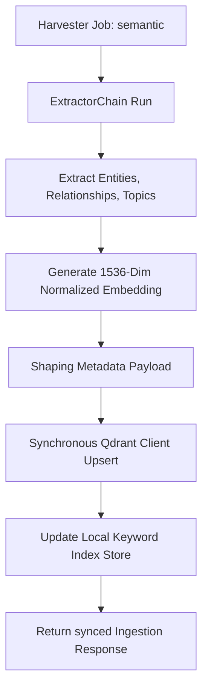
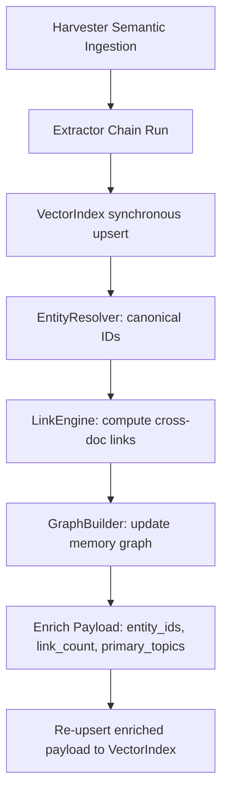
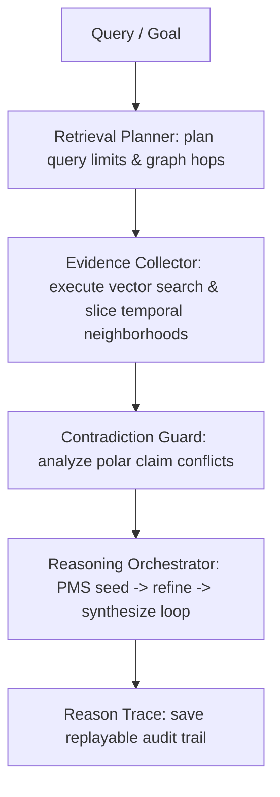

# CIC_SYSTEM.md

## 0. Multi‑Agent Runtime (External Contract)

CIC participates in a four‑agent orchestration loop with RTK, RRK‑AI, and git‑ai.
The authoritative definition of this runtime — including roles, boundaries,
data contracts, failure modes, and versioning rules — is defined in:

**CIC_AI_RUNTIME_CONTRACT.md**

This contract sits above CIC_SYSTEM.md in the documentation hierarchy and governs
all cross‑agent interactions. CIC_SYSTEM.md continues to define CIC's internal
architecture (ingestion pipeline, extractors, indexer, dashboard, control plane,
and section tracking), while the Runtime Contract defines how CIC interacts with
external agents.

---

## 1. Overview

CIC (Cast Iron Charlie Intelligence Core) is the ingestion, enrichment, and indexing
subsystem of the Cast Iron Charlie documentary intelligence engine. CIC operates
within the Runtime Contract and receives ingestion jobs from RTK, executes them
deterministically, and emits governance deltas to git-ai.

---

## 2. Core Components

### 2.1 Ingestion Pipeline

The deterministic pipeline that processes ingestion jobs:

1. **Harvester** — Fetches source content
2. **Extractor Chain** — Extracts structured data
3. **Indexer** — Indexes vectors into Qdrant
4. **Dashboard** — Surfaces results
5. **Section Tracking** — Maintains deterministic state

### 2.2 Extractor Chain

Pluggable extractors that process different content types:

- ImageAnalyzerV2 — Extracts visual information from images
- ReverseImageSearchExtractor — Finds similar images in archives
- OCR Extractor — Extracts text from images
- Custom Extractors — Domain-specific extraction logic

### 2.3 Indexer + Qdrant

Vector storage and semantic search:

- Stores embeddings with metadata payloads
- Supports semantic search across ingested content
- Maintains backup + restore capabilities

### 2.4 Control Plane

Orchestration and management:

- Job queue management
- Error handling and retry logic
- Resource monitoring
- Health checks

### 2.5 Section Tracking

Deterministic, resumable ingestion state:

- Tracks completion at section boundaries
- Enables pause/resume of ingestion
- Provides auditability
- Ensures monotonic advancement

---

## 3. Data Flows

### 3.1 Ingestion Job (RTK → CIC)

```json
{
  "job_id": "uuid",
  "type": "image | document | reverse_image",
  "source": "path or URL",
  "metadata": { }
}
```

### 3.2 Vector Payload (CIC → Qdrant)

```json
{
  "id": "fileId",
  "vector": [ ... ],
  "payload": {
    "file_path": "...",
    "extractor": "ImageAnalyzerV2 | ReverseImageSearchExtractor",
    "timestamp": "ISO"
  }
}
```

### 3.3 Governance Delta (CIC → git-ai)

```json
{
  "system_version": "1.2.1",
  "state_version": "1.3.1",
  "roadmap_version": "2.6.1",
  "changes": [ ... ]
}
```

---

## 4. Ingestion Determinism

CIC ingestion is:

- **Deterministic** — Every execution follows the same path
- **Resumable** — Can pause and resume at section boundaries
- **Auditable** — Full state visibility at each point
- **Monotonic** — Sections can only advance, never regress

---

## 5. Error Handling

When CIC fails:

- Emit error state to Section Tracking
- Emit drift detection signal to git-ai
- Block Section Tracking advancement
- git-ai runs drift check and emits research goals back to RRK-AI

---

## 6. PMS Integration & PMS v2 Compositional Engine

The Prompt Management System (PMS) has been evolved to **PMS v2**, exposing a compositional, multi‑stage prompt engine that integrates with ExtractorChain and the semantic pipeline.

### 6.1 PMS Role & V2 Capabilities

- **Composes prompts** for extractors based on content type, stages, and constraints.
- **Compositional Inheritance**: Templates can inherit from a parent template (`parent: parent_id`) and override designated slot slots (`[[block:block_name]]...[[endblock]]`) via the `blocks` dictionary in their YAML configuration.
- **Conditional Evaluation**: Resolves runtime guards using `[[if condition]]...[[endif]]` structures. Supports arbitrary combinations of logical negations (`!`), ANDs (`&&`), and ORs (`||`).
- **Vector Index Snippet Lookup Hooks**: Allows safe, rate‑limited injection of historical context directly into templates using the `[[index_lookup query="text" limit=N]]` tag.
- **Multi-Stage Orchestration & Caching**: Manages multi-pass prompt stages (`seed` $\rightarrow$ `refine` $\rightarrow$ `summarize`) inside `ExtractorChain` and leverages SHA-256 in-memory caching to skip repeat compositions.
- **Isolates Composition Failures**: Logs and captures compilation or validation failures inside the returned metadata object instead of aborting unrelated pipeline runs.

### 6.2 PMS Location in Pipeline

```
Harvester
    ↓
Control Plane (receives job)
    ↓
PMS v2 Composer (resolves inheritance, conditional blocks, index snippet lookups)
    ↓
Extractor Chain (executes multi-stage seed -> refine -> summarize passes)
    ↓
Indexer (stores vector embeddings with metadata payload in Qdrant)
    ↓
Dashboard / Section Tracking
```

### 6.3 YAML Schema & Inheritance Example

#### Base Layout Template (`base_semantic.yaml`)
```yaml
template_id: base_semantic
name: Base Semantic Template
version: "2.0.0"
extractor_type: custom
content_type: semantic
template: |
  =============================================================
  CAST IRON CHARLIE - SEMANTIC WORKFLOW
  =============================================================
  [[block:stage_header]]STAGE: Ingestion[[endblock]]

  Source text:
  """
  {source}
  """

  [[block:stage_instructions]]Core extraction rules.[[/block]]

  [[if is_final_stage]]
  Final pass compilation: Organize all facts into canonical JSON-LD.
  [[endif]]
created_at: "2026-05-30T00:00:00Z"
max_tokens: 3000
temperature: 0.2
top_p: 0.95
```

#### Child Extraction Template (`semantic_seed.yaml`)
```yaml
template_id: semantic_seed
name: Semantic Seed Stage
version: "2.0.0"
extractor_type: custom
content_type: semantic
parent: base_semantic
blocks:
  stage_header: "STAGE 1: Seed Entity Extraction"
  stage_instructions: "Extract all PEOPLE and PLACES with context."
template: ""
created_at: "2026-05-30T00:00:00Z"
max_tokens: 2000
temperature: 0.3
top_p: 0.90
```

### 6.4 PMS Caching & Multi-Stage Integration

- **Cache Key Generation**: `SHA256(template_id + stage + serialized_sorted_variables)`
- **Multi-Stage API Hook**: Exposed to `ExtractorChain` via `pms.requestPrompt(stage, context)`.
  - **Pass 1 (`seed`)**: Maps to `semantic_seed`, extracting entities from source.
  - **Pass 2 (`refine`)**: Maps to `semantic_refine`, resolving relationships, querying `[[index_lookup]]` context.
  - **Pass 3 (`summarize`)**: Maps to `semantic_summary`, generating contextual syntheses with finalization checks.

### 6.5 PMS Configuration & Diagnostics

- **Template Registry Location**: `projects/cic/pms/templates/` (supports `custom/`, `vision/`, `ocr/`)
- **Control Plane Endpoint Extensions**:
  - `GET /pms/templates`: Lists all active templates loaded in the registry.
  - `POST /pms/resolve`: Receives `templateId` and `vars`, returning the fully resolved prompt and compilation metadata for real-time debugging.

---


## 7. RTK Automation Layer (Active Automation)

RTK orchestrates active automation loops driven by contract-defined research goals:

### 7.1 Burst Ingestion Planner (Mode A)
- Batches goals received from RRK-AI into bounded ingestion sets called bursts.
- Grouping occurs by priority and target type (e.g. `image`, `text`).
- Emits structured `CICIngestionJob` models with assigned PMS templates.

### 7.2 Smoke-Test Gating (Mode B)
- Gates section-tracking state boundaries with verification checks.
- Confirms PMS template compilations succeed and extractors process jobs cleanly.
- Blocks advancement, transitions sections to `blocked:smoke_failed`, and dispatches governance warnings on failures.

### 7.3 Concurrency & Safeguards
- Emits structured backpressure controls.
- Halts executions and alerts the `cic-gitai` feedback channel if the burst-level job failure rate exceeds a 50% threshold.

### 7.4 Telemetry State Endpoint
- Exposes automation state at `GET /rtk/automation/state`.

---

## 8. Semantic Indexing Layer (v1.2.0 Phase 2)

 equips the Cast Iron Charlie pipeline with cross-document vector memory, hybrid vector-keyword search capabilities, and live diagnostics.

### 8.1 Subscription & Ingestion Flow (Inline Synchronous Braid)

Semantic jobs run through a synchronized pipeline inside the Harvester:
1. **Extractor Chain**: Evaluates the document via the compositional chain of v2 extractors (`SemanticExtractor` $\rightarrow$ `RelationshipExtractor` $\rightarrow$ `TopicExtractor`).
2. **Embedding Generation**: Encodes the raw document text into standard **1536-dimensional normalized vectors** using the `EmbeddingPipeline` (with a high-fidelity deterministic hashing fallback for isolated runtime tests).
3. **Payload Shaping**: Packs all extracted JSON-LD schemas (`entities`, `relationships`, `topics`, `summary`) into the final vector point payload.
4. **Qdrant Sync Upsert**: Synchronously commits the point to Qdrant via the client wrapper, guaranteeing atomic consistency.



### 8.2 Reciprocal Rank Fusion (RRF) Hybrid Search

To resolve the discrepancy between float-based cosine distances and integer-based keyword matches, search uses Reciprocal Rank Fusion ($k = 60$) to combine results:

$$RRF\_Score(d) = \sum_{m \in \{\text{Vector}, \text{Keyword}\}} \frac{1}{60 + \text{Rank}_m(d)}$$

1. **Vector similarity retrieval**: Queries Qdrant using Cosine distance similarity.
2. **Keyword substring retrieval**: Scans local in-memory text indexes.
3. **Fusion & Sorting**: Intersects both streams and ranks results by their cumulative reciprocal rank.

### 8.3 Control Plane Integrations

The Control Plane exposes the vector memory interface at the following endpoints:

- **`GET /index/health`**:
  Returns the live diagnostics and collection integrity report:
  ```json
  {
    "health": {
      "collection": "cic_semantic",
      "status": "green",
      "vectors": 14,
      "last_upsert": "2026-05-30T04:45:00Z",
      "embedding_version": "v2.0.0"
    }
  }
  ```

- **`POST /index/search`**:
  Processes semantic queries with optional result caps:
  ```json
  {
    "results": [
      {
        "id": "doc-uuid",
        "rrf_score": 0.0327,
        "payload": {
          "rawText": "...",
          "entities": [],
          "relationships": [],
          "topics": []
        }
      }
    ]
  }
  ```

---

## 9. Cross‑Document Linking Layer (v1.2.0 Phase 3)

The Cross-Document Linking Layer connects discrete processed documents into a unified, queryable semantic knowledge fabric. It resolves entity aliases, establishes multidimensional cross-document links, maintains an in-memory graph view, and exposes a rich query plane.

### 9.1 Linking Architecture & Pipeline

After a document is processed by the Extractor Chain and indexed into Qdrant, a post-index hook triggers the Linking pipeline:

1. **Entity Resolver**: Normalizes entity names (handling spacing, casing, and "Last, First" re-ordering) and assigns stable deterministic IDs using a typed name hash. Resolves variants/aliases using token-overlap matching and string distance metrics.
2. **Link Engine**: Analyzes the newly indexed document against all historical documents to deduce cross-document links (`same_entity`, `related_topic`, `co_occurs_with`, `references`) with confidence bounds between `0.0` and `1.0`.
3. **Graph Builder**: Updates a queryable in-memory graph containing documents and entities as nodes, and relationships and cross-document links as edges.
4. **Index Enrichment**: Enriches the indexed document's payload with `entity_ids`, `link_count`, and `primary_topics` to enable richer downstream semantic search.



### 9.2 Graph Model & Neighborhoods

The in-memory graph supports query-plane access via the following endpoints:

#### GET `/graph/summary`
Returns graph scale metrics, health diagnostics, and degrees for top entities:
```json
{
  "nodes": { "documents": 2, "entities": 5, "total": 7 },
  "edges": { "entityRelationships": 1, "crossDocLinks": 2, "docEntityLinks": 4, "total": 7 },
  "topEntities": [
    { "entityId": "ent_cb37e8badbacd399", "name": "Charles Emil Sorensen", "type": "PEOPLE", "degree": 4 }
  ],
  "health": { "status": "green", "details": "Graph initialized with 2 documents and 5 entities." }
}
```

#### GET `/graph/entity/:id`
Returns entity metadata, connected documents, and neighboring entity relationships:
```json
{
  "entity": { "id": "ent_cb37e8badbacd399", "name": "Charles Emil Sorensen", "type": "PEOPLE", "context": "Birth record", "confidence": 0.95 },
  "documents": [
    { "docId": "doc-c1", "summary": "Semantic Ingestion Summary", "timestamp": "2026-05-30T17:40:00Z" }
  ],
  "relationships": [
    { "targetEntityId": "ent_lellinge", "targetEntityName": "Lellinge", "predicate": "born_in", "confidence": 0.98, "details": "Born in Denmark" }
  ]
}
```

#### GET `/graph/document/:id`
Returns document metadata, contained entities, and related documents connected via cross-document links:
```json
{
  "document": { "docId": "doc-c2", "summary": "Semantic Ingestion Summary", "timestamp": "2026-05-30T17:40:05Z" },
  "entities": [
    { "id": "ent_cb37e8badbacd399", "name": "Charles Emil Sorensen", "type": "PEOPLE", "context": "Emigration", "confidence": 0.9 }
  ],
  "relatedDocuments": [
    { "docId": "doc-c1", "type": "same_entity", "confidence": 0.92, "details": "Both documents reference resolved entity \"Charles Emil Sorensen\"." }
  ]
}
```

---

## 10. Persistent Knowledge Graph (v1.3.1)

The Persistent Knowledge Graph replaces the ephemeral in-memory graph representation with a durable, queryable filesystem database and supports dated, non-destructive historical slicing.

### 10.1 Serialization Roundtrips & Path Security
*   **Database Files**: Serializes objects to structured JSON files under `projects/cic/data/entity-registry.json` and `projects/cic/data/graph-store.json`.
*   **Absolute Resolution**: Enforces dynamic ESM path resolution (`import.meta.url` $\rightarrow$ `fileURLToPath`) to guarantee database paths resolve identically inside both test environments and PM2 production runtimes.
*   **Transaction Gating**: Executes auto-saves synchronously inside the Harvester post-ingestion loop before indexing final RAG results.

### 10.2 Entity Lineage & Dynamic Slicing
To support temporal queries, every canonical entity stores a chronological `lineage` array recording creation, alias merges, name refinements, and context enrichments:

```typescript
export interface EntityLineageEntry {
  timestamp: string;
  docId: string;
  action: "created" | "merged_alias" | "context_enriched" | "name_updated";
  originalName?: string;
  contextAdded?: string;
}
```

*   **Dynamic Playback (`sliceAtDate`)**: Reconstructs exact node/edge states at any target timestamp `dateX` without duplicating files by replaying lineage chronologically, subtracting future context additions and reverting name refinements.

---

## 11. Retrieval-Augmented Reasoning Layer (v1.3.2)

The Reasoning Layer equips Cast Iron Charlie with multi-hop retrieval capabilities, polar claim contradiction checks, and audit-ready reasoning traces.

### 11.1 Subsystem Pipeline
The RAG reasoning query loop processes in four stages:



1.  **Retrieval Planner**: Analyzes natural language strings, matches keywords against registered canonical entities, plans graph traversals up to depth $N$, and sets strict token budgets.
2.  **Evidence Collector**: Aggregates ranked float-based vector results, loads sliced graph neighborhoods, and filters entries dynamically based on `sliceAtDate`.
3.  **Contradiction Guard**: Compares evidence strings for polar facts (e.g. origins associated with Denmark vs Chicago/Detroit) and flags contested claims.
4.  **Reasoning Orchestrator**: Executes a multi-pass compositional prompting chain (`seed` $\rightarrow$ `refine` $\rightarrow$ `synthesize`) via PMS v2 to compile the final answered RAG summary.

### 11.2 Trace Schema & Auditing
Reasoning traces are saved as audit-ready JSON logs under `projects/cic/data/traces/`:

```json
{
  "traceId": "trc_uuid",
  "query": "Charles Sorensen birthplace",
  "plan": { ... },
  "evidenceEvaluated": [
    { "evidenceId": "doc-A", "type": "document", "score": 0.95, "action": "used", "reason": "Matched constraints" }
  ],
  "contradictionsDetected": [
    { "claimA": "Denmark origins", "claimB": "Chicago origins", "severity": "high" }
  ],
  "stageLatenciesMs": { "planning": 12, "collection": 145, "reasoning_loop": 402 },
  "finalAnswer": "...",
  "confidence": "low",
  "isContested": true
}
```

---

## 12. SkillOpt Subsystem (v0.1.0 — Stage 2 Integration)

CIC integrates with SkillOpt to train and deploy self-improving skills (starting with **RewriteLabs Redesign**).

### 12.1 Purpose & Integration

SkillOpt turns CIC's documentary analysis pipeline into a **skill trainer**:

- **Data Production:** Harvester emits `SkillOptItem` JSON files (DOM snapshot + audit deltas + target redesign) when `--emit-skillopt` is enabled.
- **Validation:** SkillOptValidator scores outputs against inputs across 6 metrics (structural completeness, heuristic alignment, a11y, performance, brand voice, determinism).
- **Training:** SkillOpt consumes items from `./skillopt/data/{train,val,test}` and trains skill templates (external Python harness).
- **Deployment:** `skillopt:deploy` exports `best_skill.md` and registers it in the runtime SkillRegistry.
- **Runtime:** CIC loads `best_skill.md` via `SkillRegistryLoader` and passes it to RedesignAgent.
- **Observability:** SkillOptTelemetry logs skill versions, validation scores, and runtime metrics.

### 12.2 Data Contract: SkillOptItem

Emitted by Harvester after `SYNTHESIZE`:

```json
{
  "id": "item_uuid",
  "input": {
    "dom": "<html>...</html>",
    "content_blocks": [ { "type": "nav", "text": "...", "role": "..." }, ... ],
    "audit_deltas": { "contrast_issue_1": 0.6, "layout_reflow": 0.4, ... },
    "heuristics": { "ux_score": 0.72, "ia_score": 0.81, ... }
  },
  "target": {
    "redesign_plan": "# Redesign Summary\n..."
  },
  "metadata": {
    "url": "...",
    "brand_voice": "modern, accessible, conversational",
    "timestamp": "ISO"
  }
}
```

### 12.3 Validation Metrics

SkillOptValidator computes 6 scores (0-1):

1. **structural_completeness:** Required sections present in redesign output.
2. **heuristic_alignment:** Redesign addresses audit deltas from input.
3. **accessibility_uplift:** Covers a11y issues (contrast, alt text, labels).
4. **performance_uplift:** Covers perf issues (LCP, CLS, bundling, lazy loading).
5. **brand_voice_similarity:** Output aligns with brand vocabulary.
6. **determinism_score:** Consistency across multiple rollouts.

### 12.4 CLI Commands (Stage 2-3)

**Stage 2 (Active):**
```bash
cic skillopt:emit [--url-pattern PATTERN]
  # Run pipeline and emit SkillOptItems to ./skillopt/data

cic skillopt:validate <item.json> <output.md>
  # Score a single redesign output against its input
  # Returns JSON with 6 validation metrics
```

**Stage 3 (Upcoming):**
```bash
cic skillopt:data-gen [--base-dir DIR]
  # Generate synthetic SkillOptItems for testing

cic skillopt:train [--config skillopt-config-redesign.yaml]
  # Train Redesign skill from ./skillopt/data

cic skillopt:deploy [--skill-version V]
  # Export best_skill.md and reload SkillRegistry

cic skillopt:telemetry [--recent N]
  # Show skill versions, validation scores, rollout metrics
```

### 12.5 Governance

- **TokenEconomyAgent:** SkillOpt training respects max_cost budget.
- **SecuritySentinelAgent:** Exported skills signed with SHA-256; validation gate required before deploy.
- **AuditAgent:** Every skill rollout audited; regressions logged and flagged.

### 12.6 Stage 3 Dependencies

Stage 3 (train/deploy/runtime) requires:

- [x] **SkillRegistryLoader** (`projects/cic/src/skills/SkillRegistryLoader.ts`) — Load and cache trained skills at runtime.
- [x] **RedesignAgent skill-awareness** — Accept loaded skill as constructor parameter.
- [ ] **Python training harness integration** — Wire `skillopt:train` CLI to external trainer.

See **CIC_SKILLOPT_SYSTEM.md** for full subsystem specification.

---

## 13. Observability Subsystem (v1.3.3 — Cockpit and Telemetry v2)

The Observability Subsystem exposes real-time runtime diagnostics, rates, latencies, and automation logs across all five architectural pillars.

### 13.1 Telemetry Core Architecture
Telemetry is driven by an in-memory `MetricsCollector` loaded in the Express control plane. System timing and event counters are gathered via inline instrumentation hooks:

*   **Ingestion & Extractors**: Logs rolling documents/min, errors/min, and individual stage execution times for `SemanticExtractor`, `RelationshipExtractor`, and `TopicExtractor` inside `ExtractorChain.run()`.
*   **Vector Memory (Qdrant)**: Computes p50/p95/p99 query latencies using circular arrays of size 1,000, bounding telemetry memory footprint.
*   **Persistent Graph**: Logs start-up database deserialization durations (`recordGraphLoad`) and tracks manual/auto snapshot serialization sizes and durations.
*   **RAG Reasoning**: Tracks stages per query, evidence sizes, and contradiction markers (`contradictionRate`).
*   **RTK Automation**: Records safeguard violations, active/dry-run states, and recent automated interventions.

### 13.2 Control Plane Telemetry Router
Exposes routes for the operator dashboard under `/metrics`:
*   `GET /metrics/snapshot`: Returns a compiled JSON representation of current statistics.
*   `GET /metrics/stream`: Real-time SSE (Server-Sent Events) streaming endpoint delivering sub-second updates.
*   `POST /metrics/reset`: Wipes in-memory buffers to reset benchmarks.

### 13.3 High-Density Dashboard Cockpit
Upgraded `canary-dashboard.html` features a glassmorphism dark-theme dashboard visualizing all five telemetry panels, and integrates an inline multi-hop RAG testing console with direct trace audits.

---

## 14. Multi‑Tenant Knowledge Fabric & Episode Builder (v1.4.0)

CIC v1.4.0 introduces robust **Multi-Tenant Knowledge Fabric** isolation and the **Documentary Episode Builder Engine**.

### 14.1 Tenant-Scoped Persistences
- **Entity Resolver**: Registries and name-refinement lineages are dynamically partitioned per tenant in-memory and saved under `data/tenants/{tenantId}/entity-registry.json`.
- **Memory Graph**: Document nodes, relationship occurrences, date slicings, and checkpoints are partitioned under `data/tenants/{tenantId}/graph-store.json`.
- **Vector index**: Queries isolated Qdrant collection namespaces `cic_semantic_{tenantId}` and keyword matching stores in-memory.

### 14.2 Documentary Episode Builder Engine
- Exposes stable REST routes `/v1/episode/build`, `/v1/episode/expand`, and `/v1/episode/summarize` in [v1-router.ts](file:///c:/dev/rewrite-mcp/projects/cic/src/cic/control-plane/v1-router.ts).
- Drives multi-hop graph retrieval and temporal neighborhood playbacks to compile structured creative Act Outlines, detailed scene expansions, and cinematic biographic syntheses.
- Coordinates prompts dynamically using custom templates: `episode_build.yaml`, `episode_expand.yaml`, and `episode_summarize.yaml`.

---

**Version:** 1.4.0  
**Last Updated:** 2026-05-30  
**Owner:** CIC-SYSTEM  
**Status:** ACTIVE  

See **CIC_AI_RUNTIME_CONTRACT.md** for multi-agent orchestration details.
See **PMS_INTEGRATION_SPECIFICATION.md** for Prompt Management System details.
See **CIC_SKILLOPT_SYSTEM.md** for SkillOpt subsystem specification.

