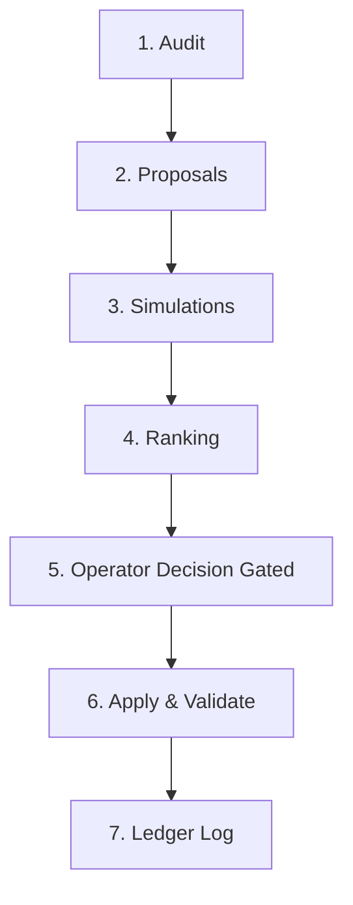

# Meta Evolution Logic Loop Specification (Phase 10)

## Overview
The **Meta Evolution Logic Loop** represents the brainstem of Cast Iron Charlie's self-evolving codebase. It coordinates safety, validation, and optimization over the system's own components. It enforces governed autonomy, ensuring that all proposed code modifications undergo strict validation, simulations, ranking, and manual operator approval before execution.

---

## Evolution Stages



### 1. Audit Stage
- **Description**: Scans the active system state, CKG nodes, MAS performance logs, and drift metrics to identify anomalies, bottlenecks, complexity clusters, or test failures.
- **Inputs**: CKG state, MAS telemetry, test coverage, static analysis outputs.
- **Output**: `audit.json` (lists identified issues, current drift coefficient, bottlenecked paths, and system health status).

### 2. Proposals Stage
- **Description**: Formulates code changes, capability expansions, or configuration autotunes to resolve the issues found in the Audit stage.
- **Inputs**: `audit.json`, template heuristics, capability gap registry.
- **Output**: `proposals.json` (a list of patch sets containing file paths, modification type, and proposed code replacements).

### 3. Simulation Stage
- **Description**: Validates the proposed patches in a safe, isolated dry-run environment. Checks for basic compile ability, syntax correctness, and structural conflicts.
- **Inputs**: `proposals.json`.
- **Output**: `simulations.json` (simulation status, compilation status, syntax validation results).

### 4. Ranking Stage
- **Description**: Assigns scores to simulation-passing proposals based on expected utility, impact/risk ratios, alignment with current goals, and complexity changes.
- **Inputs**: `simulations.json`.
- **Output**: `ranked_proposals.json` (proposals prioritized by score, from highest-signal to lowest-signal).

### 5. Operator Decision Stage
- **Description**: Exposes the ranked list of proposals to the operator for review. Direct auto-application is prohibited.
- **Inputs**: `ranked_proposals.json`, existing decision files.
- **Output**: `decisions.json` (operator actions: `approved`, `rejected`, or `deferred`).

### 6. Apply Stage
- **Description**: Executes the changes for all proposals marked as `approved` in `decisions.json`. Employs automatic rollback safety if any post-apply checks or unit tests fail.
- **Inputs**: `decisions.json`, codebase.
- **Output**: `applied_changes.json` (the list of successfully written files, backup locations, and rollback logs if any failed).

### 7. Log Stage
- **Description**: Commits metadata, execution times, diff reports, and final metrics of the run into the persistent evolution ledger.
- **Inputs**: All stage outputs.
- **Output**: Writes final run receipt, updates CKG with evolution edges, and logs tracking metrics.

---

## Hard Rules & Constraints

1. **Veto-by-Default (No Direct Auto-Apply)**: The loop orchestrator will *never* write code changes to the live project files without an explicit `approved` decision status in the ledger.
2. **Ledger Immutability**: All run artifacts are saved under an isolated, timestamped run directory inside the evolution ledger.
3. **Rollback Integrity**: If applying an approved proposal breaks compilation or tests, the orchestrator must instantly restore the codebase snapshot.
4. **Lineage Tracing**: Every code modification must link back to a specific discovery, tenant request, or system bottleneck.

---

## Artifact Folder Structure

All evolution runs log data to:
`projects/cic/evolution/data/`

Under this root, runs are organized as follows:
```text
projects/cic/evolution/data/
├── runs/
│   └── run_<run_id>_<timestamp>/
│       ├── audit.json
│       ├── proposals.json
│       ├── simulations.json
│       ├── ranked_proposals.json
│       ├── decisions.json
│       └── applied_changes.json
```

---

## Data Schema Contracts

### `audit.json`
```json
{
  "runId": "string",
  "timestamp": 0,
  "systemDrift": 0.0,
  "anomalies": [
    {
      "id": "string",
      "type": "string",
      "description": "string",
      "severity": "low|medium|high|critical"
    }
  ]
}
```

### `proposals.json`
```json
{
  "runId": "string",
  "proposals": [
    {
      "proposalId": "string",
      "title": "string",
      "patches": [
        {
          "path": "string",
          "type": "create|modify",
          "content": "string"
        }
      ]
    }
  ]
}
```

### `decisions.json`
```json
{
  "runId": "string",
  "decisionTimestamp": 0,
  "decisions": {
    "proposal-id-1": "approved|rejected|deferred",
    "proposal-id-2": "approved|rejected|deferred"
  }
}
```

---

## AMB Integration (Phase 4)

The **Autonomous Meta-Brain (AMB)** extends the Evolution Loop from reactive anomaly resolution to **strategic, intent-driven self-evolution**.

### AMB → Evolution Loop Pipeline

```
AMB Orchestrator (ambRunner.ts)
  │
  ├── 1. collectSignals()          — CKG drift, MAS health, RL metrics
  ├── 2. priorityEngine            — scores: graph_distillation, mas_stability, planner_tuning, rl_fusion
  ├── 3. intentSynthesizer         — generates AmbIntentArtifact[]
  ├── 4. policyInterpreter         — forbidden/operator/lineage/rl_dependent classification
  ├── 5. governanceGate            — status: approved | blocked | downgraded | pending
  ├── 6. memoryStore               — loads cross-run memory snapshot
  ├── 7. strategicScorer           — ranks by impact/(risk × operator_burden)
  ├── 8. intentBundler             — groups into graph_cleanup | mas_stability | tenant_redesign | planner_tuning
  ├── 9. strategicPlanner          — generates multi-step plan (3-run horizon)
  ├── 10. memoryStore.recordRun()  — persists run data to memory ledger
  ├── 11. persistArtifacts()       — writes intents, logs, reports, strategic plan, bundles
  └── 12. triggerLoop()            — launches LoopRunner with approved intents
              │
              └── LoopRunner receives AmbIntentArtifact[]
                  ├── Maps intents → proposals (with source_intent_id, risk_class, status)
                  ├── Simulates, ranks, applies
                  └── Logs CKG lineage edges (evolution_run → initiated_by → amb_intent)
```

### Governance Gate Rules

| Condition | Intent Status |
|-----------|--------------|
| Forbidden domain (security, auth, billing) | `blocked` |
| RL-dependent + RL tests failing | `blocked` |
| MAS health below thresholds | `downgraded` |
| High-risk class | `pending` (operator review) |
| All gates pass, low/medium risk | `approved` |

### Strategic Planning

The strategic planner detects 4 cross-run patterns:
- **recurring_drift** — persistent tenant drift > 0.2
- **persistent_mas_instability** — MAS error rate > 0.03
- **rl_plateau** — RL metrics flat across runs
- **stale_graph** — graph distillation block rate > 30%

Plans follow a sequenced strategy: **cleanup → stabilize → tune → redesign**.

### Updated Artifact Folder Structure

```text
projects/cic/evolution/data/
├── runs/
│   └── run_<run_id>_<timestamp>/
│       ├── audit.json
│       ├── proposals.json               # now includes source_intent_id, risk_class, status
│       ├── simulations.json
│       ├── ranked_proposals.json
│       ├── decisions.json
│       └── applied_changes.json
├── evolution/amb/
│   ├── intents/
│   │   └── amb_intents_<run_id>.json    # all intents with governance status
│   ├── logs/
│   │   └── amb_log_<run_id>.json        # governance report + triggered_evolution_run
│   └── reports/
│       └── amb_report_<run_id>.json     # summary metrics
├── amb/
│   ├── strategic/
│   │   ├── strategic_plan_<run_id>.json # multi-step plan with impact projections
│   │   └── intent_bundles_<run_id>.json # domain-grouped intent bundles
│   └── memory/
│       └── memory_<timestamp>.json      # accumulated cross-run snapshot
└── policy_charter.json                  # forbidden/operator/lineage domain config
```

### Key Source Files

| File | Purpose |
|------|---------|
| `evolution/src/loopRunner.ts` | 8-stage evolution lifecycle |
| `evolution/src/amb/ambRunner.ts` | 13-stage AMB orchestrator (v1.1.0) |
| `evolution/src/amb/ambPriorityEngine.ts` | Signal → priority scoring |
| `evolution/src/amb/ambIntentSynthesizer.ts` | Priority → intent generation |
| `evolution/src/amb/ambPolicyInterpreter.ts` | Charter-based policy classification |
| `evolution/src/amb/ambGovernanceGate.ts` | MAS + RL + forbidden domain gating |
| `evolution/src/amb/ambMasHealthGate.ts` | MAS stability threshold checks |
| `evolution/src/amb/ambRlTestGate.ts` | Rewrite Labs test gate |
| `evolution/src/amb/ambMemoryStore.ts` | Cross-run memory accumulation |
| `evolution/src/amb/ambStrategicScorer.ts` | Strategic scoring engine |
| `evolution/src/amb/ambIntentBundler.ts` | Domain-based intent bundling |
| `evolution/src/amb/ambStrategicPlanner.ts` | Multi-run pattern detection and planning |
| `evolution/src/types/ambIntent.ts` | Intent artifact type definition |
| `evolution/src/types/ambPolicyCharter.ts` | Policy charter type |
| `evolution/src/types/ambStrategic.ts` | Memory, bundle, and plan types |

